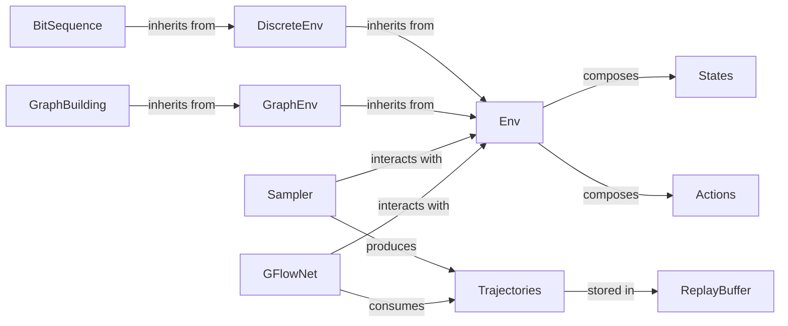

## Details

Abstract Components Overview

### Env
The abstract base class for all environments. It defines the core interface for state representation, action space, state transitions, and reward functions. It serves as the primary contract for GFlowNet agents to interact with any problem.

**Related Classes/Methods**:

- <a href="https://github.com/gfnorg/torchgfn/blob/master/src/gfn/env.py#L14-L413" target="_blank" rel="noopener noreferrer">`gfn.env.env.Env` (14:413)</a>

### DiscreteEnv
An abstract specialization of `Env` tailored for environments with discrete state and action spaces. It provides common functionalities and assumptions relevant to discrete problems.

**Related Classes/Methods**:

- <a href="https://github.com/gfnorg/torchgfn/blob/master/src/gfn/env.py#L416-L746" target="_blank" rel="noopener noreferrer">`gfn.env.discrete.DiscreteEnv` (416:746)</a>

### GraphEnv
An abstract specialization of `Env` designed for environments where states and actions involve graph structures. It includes methods and properties relevant to graph manipulation and traversal.

**Related Classes/Methods**:

- <a href="https://github.com/gfnorg/torchgfn/blob/master/src/gfn/env.py#L749-L915" target="_blank" rel="noopener noreferrer">`gfn.env.graph.GraphEnv` (749:915)</a>

### BitSequence
A concrete implementation of a `DiscreteEnv` for problems involving the generation or manipulation of bit sequences. It defines specific state transitions and reward structures for this domain.

**Related Classes/Methods**:

- <a href="https://github.com/gfnorg/torchgfn/blob/master/src/gfn/gym/bitSequence.py#L183-L705" target="_blank" rel="noopener noreferrer">`gfn.gym.bitSequence.BitSequence` (183:705)</a>

### GraphBuilding
A concrete implementation of a `GraphEnv` for problems focused on building graphs incrementally. It defines the rules for adding nodes and edges and the associated rewards.

**Related Classes/Methods**:

- <a href="https://github.com/gfnorg/torchgfn/blob/master/src/gfn/gym/graph_building.py#L14-L391" target="_blank" rel="noopener noreferrer">`gfn.gym.graph_building.GraphBuilding` (14:391)</a>

### States
Defines the representation and manipulation of the current state within an environment. It handles state initialization, batching, and provides methods for state-specific operations.

**Related Classes/Methods**:

- <a href="https://github.com/gfnorg/torchgfn/blob/master/src/gfn/states.py#L26-L435" target="_blank" rel="noopener noreferrer">`gfn.states.States` (26:435)</a>

### Actions
Defines the set of valid actions that can be taken from a given state within an environment. It includes methods for sampling actions and managing action spaces.

**Related Classes/Methods**:

- <a href="https://github.com/gfnorg/torchgfn/blob/master/src/gfn/actions.py#L11-L268" target="_blank" rel="noopener noreferrer">`gfn.actions.Actions` (11:268)</a>

### Sampler
Responsible for interacting with the `Env` to generate trajectories of states and actions. It simulates the agent's interaction with the environment to collect data for training.

**Related Classes/Methods**:

- <a href="https://github.com/gfnorg/torchgfn/blob/master/src/gfn/samplers.py#L18-L311" target="_blank" rel="noopener noreferrer">`gfn.samplers.sampler.Sampler` (18:311)</a>

### GFlowNet
The core GFlowNet algorithm component. It interacts with the `Environment` to learn a generative policy by optimizing various objectives (e.g., Detailed Balance, Trajectory Balance).

**Related Classes/Methods**:

- <a href="https://github.com/gfnorg/torchgfn/blob/master/src/gfn/gflownet/base.py#L40-L145" target="_blank" rel="noopener noreferrer">`gfn.gflownet.base.GFlowNet` (40:145)</a>

### Trajectories
Specifically hold sequences of states and actions generated during interactions with the environment.

**Related Classes/Methods**:

- <a href="https://github.com/gfnorg/torchgfn/blob/master/src/gfn/containers/trajectories.py#L16-L604" target="_blank" rel="noopener noreferrer">`gfn.containers.trajectories.Trajectories` (16:604)</a>

### ReplayBuffer
Provides a mechanism for efficient storage and retrieval of trajectories for training.

**Related Classes/Methods**:

- <a href="https://github.com/gfnorg/torchgfn/blob/master/src/gfn/containers/replay_buffer.py#L32-L216" target="_blank" rel="noopener noreferrer">`gfn.containers.replay_buffer.ReplayBuffer` (32:216)</a>

### [FAQ](https://github.com/CodeBoarding/GeneratedOnBoardings/tree/main?tab=readme-ov-file#faq)