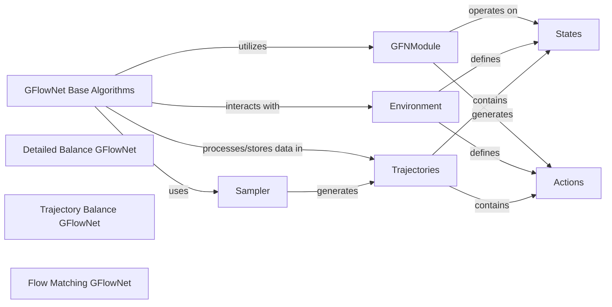

## Details

One paragraph explaining the functionality which is represented by this graph. What the main flow is and what is its purpose.

### GFlowNet Base Algorithms
This is the abstract base class for all GFlowNet algorithms. It defines the core interface and common functionalities for GFlowNet training, including methods for sampling trajectories, computing losses, and updating models. It serves as the foundation for various GFlowNet training objectives.

**Related Classes/Methods**:

- <a href="https://github.com/gfnorg/torchgfn/blob/master/src/gfn/gflownet/base.py#L40-L145" target="_blank" rel="noopener noreferrer">`gfn.gflownet.base.GFlowNet` (40:145)</a>

### Detailed Balance GFlowNet
Implements the Detailed Balance (DB) training objective, a fundamental GFlowNet algorithm that ensures the flow of probability mass between states is balanced. It inherits from `PFBasedGFlowNet`, indicating its reliance on path-flow-based objectives.

**Related Classes/Methods**:

- <a href="https://github.com/gfnorg/torchgfn/blob/master/src/gfn/gflownet/detailed_balance.py#L42-L275" target="_blank" rel="noopener noreferrer">`gfn.gflownet.detailed_balance.DBGFlowNet` (42:275)</a>

### Trajectory Balance GFlowNet
Implements the Trajectory Balance (TB) training objective, another key GFlowNet algorithm that optimizes the GFlowNet by balancing the probability of entire trajectories. It inherits from `TrajectoryBasedGFlowNet`, indicating its focus on full trajectory probabilities.

**Related Classes/Methods**:

- <a href="https://github.com/gfnorg/torchgfn/blob/master/src/gfn/gflownet/trajectory_balance.py#L21-L127" target="_blank" rel="noopener noreferrer">`gfn.gflownet.trajectory_balance.TBGFlowNet` (21:127)</a>

### Flow Matching GFlowNet
Implements the Flow Matching (FM) training objective, which directly optimizes the flow function of the GFlowNet. This approach can be more stable and efficient in certain scenarios.

**Related Classes/Methods**:

- <a href="https://github.com/gfnorg/torchgfn/blob/master/src/gfn/gflownet/flow_matching.py#L19-L283" target="_blank" rel="noopener noreferrer">`gfn.gflownet.flow_matching.FMGFlowNet` (19:283)</a>

### GFNModule
This is the base class for neural network modules used within GFlowNets. These modules typically estimate probabilities (e.g., forward or backward policies) or state flows. GFlowNet algorithms interact with `GFNModule` instances to obtain the necessary predictions for loss computation and model updates.

**Related Classes/Methods**:

- <a href="https://github.com/gfnorg/torchgfn/blob/master/src/gfn/modules.py#L22-L140" target="_blank" rel="noopener noreferrer">`gfn.modules.GFNModule` (22:140)</a>

### Environment [[Expand]](./Environment.md)
Represents the environment in which the GFlowNet operates. It defines the state space, action space, and reward function. GFlowNet algorithms interact with the `Environment` to sample states and actions, and to evaluate the reward of terminal states.

**Related Classes/Methods**:

- <a href="https://github.com/gfnorg/torchgfn/blob/master/src/gfn/env.py#L14-L413" target="_blank" rel="noopener noreferrer">`gfn.env.Env` (14:413)</a>

### Sampler
Abstract base class for various sampling strategies used to generate trajectories within the GFlowNet training loop. GFlowNet algorithms utilize samplers to explore the state space and collect data for training.

**Related Classes/Methods**:

- <a href="https://github.com/gfnorg/torchgfn/blob/master/src/gfn/samplers.py#L18-L311" target="_blank" rel="noopener noreferrer">`gfn.samplers.Sampler` (18:311)</a>

### Trajectories
A data structure for storing and managing collections of trajectories generated by the GFlowNet. GFlowNet algorithms process and store sampled trajectories in this container for loss computation and replay.

**Related Classes/Methods**:

- <a href="https://github.com/gfnorg/torchgfn/blob/master/src/gfn/containers/trajectories.py#L16-L604" target="_blank" rel="noopener noreferrer">`gfn.containers.trajectories.Trajectories` (16:604)</a>

### States
An abstract base class representing the states within the GFlowNet environment. Concrete implementations like `DiscreteStates` or `GraphStates` define the specific representation of states. GFlowNet algorithms operate on these state representations.

**Related Classes/Methods**:

- <a href="https://github.com/gfnorg/torchgfn/blob/master/src/gfn/states.py#L26-L435" target="_blank" rel="noopener noreferrer">`gfn.states.States` (26:435)</a>

### Actions
An abstract base class representing the actions that can be taken within the GFlowNet environment. Concrete implementations define the specific types of actions (e.g., `GraphActions`). GFlowNet algorithms use actions to transition between states.

**Related Classes/Methods**:

- <a href="https://github.com/gfnorg/torchgfn/blob/master/src/gfn/actions.py#L11-L268" target="_blank" rel="noopener noreferrer">`gfn.actions.Actions` (11:268)</a>

### [FAQ](https://github.com/CodeBoarding/GeneratedOnBoardings/tree/main?tab=readme-ov-file#faq)