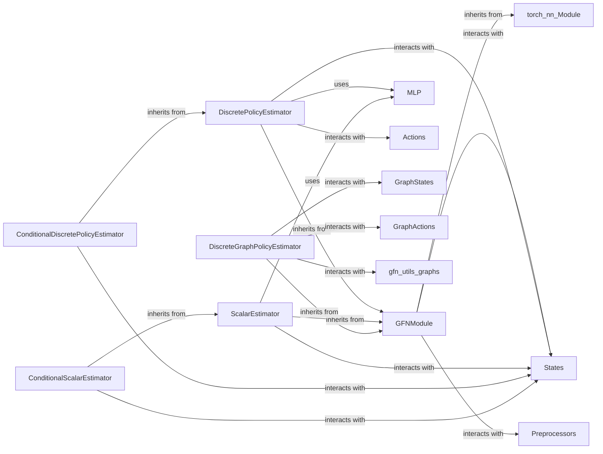

## Details

One paragraph explaining the functionality which is represented by this graph. What the main flow is and what is its purpose.

### GFNModule
This is the abstract base class (`torch.nn.Module`) for all neural network modules within `torchgfn` that are specifically designed to be used in GFlowNet algorithms. It defines the fundamental interface for the forward pass, ensuring compatibility and interchangeability across various GFlowNet implementations. It processes state and action representations to produce outputs relevant to GFlowNet quantities (e.g., policy logits, state flow values).

**Related Classes/Methods**:

- <a href="https://github.com/gfnorg/torchgfn/blob/master/src/gfn/modules.py#L22-L140" target="_blank" rel="noopener noreferrer">`gfn.modules.GFNModule` (22:140)</a>

### DiscretePolicyEstimator
A concrete implementation of `GFNModule` tailored for estimating policies in environments with discrete action spaces. It takes state representations as input and outputs logits over the possible discrete actions, which are then used by samplers to select actions or by GFlowNet algorithms to calculate probabilities.

**Related Classes/Methods**:

- <a href="https://github.com/gfnorg/torchgfn/blob/master/src/gfn/modules.py#L211-L314" target="_blank" rel="noopener noreferrer">`gfn.modules.DiscretePolicyEstimator` (211:314)</a>

### ScalarEstimator
A concrete implementation of `GFNModule` designed to estimate a single scalar value for a given state. This is typically used to estimate state flow values (F(s)), log-partition functions (Z), or other scalar quantities crucial for various GFlowNet objectives (e.g., in Flow Matching GFlowNets).

**Related Classes/Methods**:

- <a href="https://github.com/gfnorg/torchgfn/blob/master/src/gfn/modules.py#L143-L208" target="_blank" rel="noopener noreferrer">`gfn.modules.ScalarEstimator` (143:208)</a>

### DiscreteGraphPolicyEstimator
A specialized `GFNModule` for estimating policies in graph-based environments where actions involve modifying graph structures (e.g., adding nodes or edges). It processes graph state representations and outputs logits for discrete graph-building actions, often leveraging Graph Neural Networks (GNNs) internally.

**Related Classes/Methods**:

- <a href="https://github.com/gfnorg/torchgfn/blob/master/src/gfn/modules.py#L491-L685" target="_blank" rel="noopener noreferrer">`gfn.modules.DiscreteGraphPolicyEstimator` (491:685)</a>

### MLP
A general-purpose Multi-Layer Perceptron (MLP) module. While not directly a `GFNModule` itself, it serves as a fundamental, reusable building block for constructing the internal layers of more specialized `GFNModule` implementations (e.g., `DiscretePolicyEstimator` or `ScalarEstimator` might internally compose an `MLP`).

**Related Classes/Methods**:

- <a href="https://github.com/gfnorg/torchgfn/blob/master/src/gfn/utils/modules.py#L14-L107" target="_blank" rel="noopener noreferrer">`gfn.utils.modules.MLP` (14:107)</a>

### ConditionalDiscretePolicyEstimator
An extension of `DiscretePolicyEstimator` that allows the policy estimation to be conditioned on additional input features or context beyond just the state. This enables more flexible and powerful policy networks that can adapt their behavior based on auxiliary information.

**Related Classes/Methods**:

- <a href="https://github.com/gfnorg/torchgfn/blob/master/src/gfn/modules.py#L317-L395" target="_blank" rel="noopener noreferrer">`gfn.modules.ConditionalDiscretePolicyEstimator` (317:395)</a>

### ConditionalScalarEstimator
An extension of `ScalarEstimator` that allows the scalar estimation to be conditioned on additional input features or context beyond just the state. This enables more flexible and powerful scalar networks that can adapt their behavior based on auxiliary information.

**Related Classes/Methods**:

- <a href="https://github.com/gfnorg/torchgfn/blob/master/src/gfn/modules.py#L398-L488" target="_blank" rel="noopener noreferrer">`gfn.modules.ConditionalScalarEstimator` (398:488)</a>

### [FAQ](https://github.com/CodeBoarding/GeneratedOnBoardings/tree/main?tab=readme-ov-file#faq)