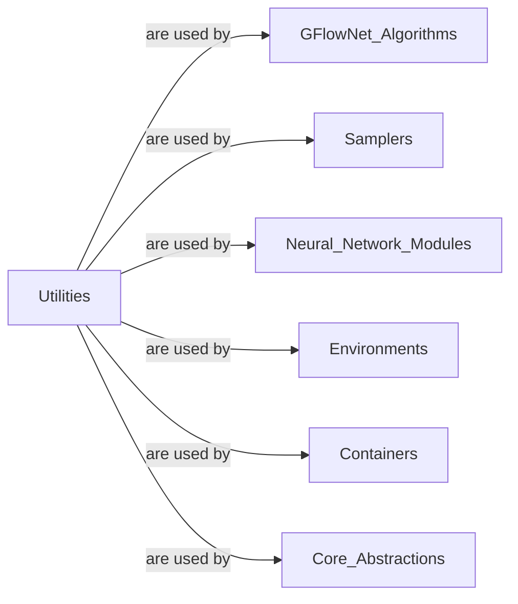

## Details

The `Utilities` component is fundamental to a Deep Learning Library/Framework like GFN because it encapsulates common, reusable functionalities that are not specific to any single core abstraction or algorithm but are broadly applicable across the entire system. By centralizing these helper functions and modules, the architecture promotes:

1.  **Modularity and Reusability**: Prevents code duplication and ensures consistency in common operations (e.g., probability calculations, graph handling) across different parts of the library.
2.  **Maintainability**: Changes or improvements to a utility function can be made in one place, benefiting all components that use it.
3.  **Decoupling**: It helps in decoupling core components (like GFlowNet algorithms or environments) from the low-level implementation details of common tasks, making the core logic cleaner and easier to understand.
4.  **Efficiency**: Provides optimized implementations for frequently used operations, contributing to the overall performance of the library.

The sub-modules within `gfn.utils` (e.g., `prob_calculations`, `graphs`, `training`, `modules`) represent distinct categories of these general-purpose functionalities, making `Utilities` a crucial support layer for the entire GFN framework.

### Utilities [[Expand]](./Utilities.md)
A comprehensive collection of general-purpose helper functions and modules that provide foundational support across the GFN library. This includes functionalities for probability calculations, graph operations, training loop utilities, common helper functions, statistical distributions, data handling, and reusable neural network building blocks. These utilities ensure efficient data manipulation, mathematical operations, and provide common infrastructure for various components.

**Related Classes/Methods**:

- <a href="https://github.com/gfnorg/torchgfn/blob/master/src/gfn/utils/prob_calculations.py#L1-L1" target="_blank" rel="noopener noreferrer">`gfn.utils.prob_calculations` (1:1)</a>
- <a href="https://github.com/gfnorg/torchgfn/blob/master/src/gfn/utils/graphs.py#L1-L1" target="_blank" rel="noopener noreferrer">`gfn.utils.graphs` (1:1)</a>
- <a href="https://github.com/gfnorg/torchgfn/blob/master/src/gfn/utils/training.py#L1-L1" target="_blank" rel="noopener noreferrer">`gfn.utils.training` (1:1)</a>
- <a href="https://github.com/gfnorg/torchgfn/blob/master/src/gfn/utils/common.py#L1-L1" target="_blank" rel="noopener noreferrer">`gfn.utils.common` (1:1)</a>
- <a href="https://github.com/gfnorg/torchgfn/blob/master/src/gfn/utils/distributions.py#L1-L1" target="_blank" rel="noopener noreferrer">`gfn.utils.distributions` (1:1)</a>
- <a href="https://github.com/gfnorg/torchgfn/blob/master/src/gfn/utils/handlers.py#L1-L1" target="_blank" rel="noopener noreferrer">`gfn.utils.handlers` (1:1)</a>
- <a href="https://github.com/gfnorg/torchgfn/blob/master/src/gfn/utils/modules.py#L1-L1" target="_blank" rel="noopener noreferrer">`gfn.utils.modules` (1:1)</a>

### [FAQ](https://github.com/CodeBoarding/GeneratedOnBoardings/tree/main?tab=readme-ov-file#faq)