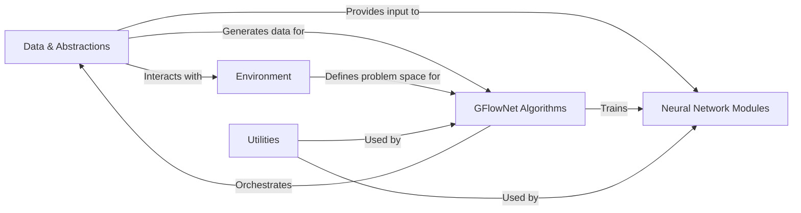

## Details

Abstract Components Overview

### Data & Abstractions
Defines the fundamental data structures for representing states and actions (gfn.states, gfn.actions). It also handles the generation of trajectories, storage in replay buffers, and preprocessing of data for neural network input. This component provides the raw and processed data for the learning process.

**Related Classes/Methods**:

- <a href="https://github.com/gfnorg/torchgfn/blob/master/src/gfn/states.py#L0-L1" target="_blank" rel="noopener noreferrer">`gfn.states` (0:1)</a>
- <a href="https://github.com/gfnorg/torchgfn/blob/master/src/gfn/actions.py#L0-L1" target="_blank" rel="noopener noreferrer">`gfn.actions` (0:1)</a>
- <a href="https://github.com/gfnorg/torchgfn/blob/master/src/gfn/samplers.py#L0-L1" target="_blank" rel="noopener noreferrer">`gfn.samplers` (0:1)</a>
- `gfn.containers` (0:1)
- <a href="https://github.com/gfnorg/torchgfn/blob/master/src/gfn/preprocessors.py#L0-L1" target="_blank" rel="noopener noreferrer">`gfn.preprocessors` (0:1)</a>

### Environment [[Expand]](./Environment.md)
Encapsulates the problem domain, defining state transitions, reward functions, and valid actions. It serves as the interface for the GFlowNet agent to interact with the specific task, including concrete implementations for various problems.

**Related Classes/Methods**:

- <a href="https://github.com/gfnorg/torchgfn/blob/master/src/gfn/env.py#L0-L1" target="_blank" rel="noopener noreferrer">`gfn.env` (0:1)</a>
- `gfn.gym` (0:1)

### Neural Network Modules [[Expand]](./Neural_Network_Modules.md)
Implements the neural network architectures used to estimate GFlowNet-related quantities (e.g., policies, state flows). These are the learnable components that process data and inform decision-making within the GFN framework.

**Related Classes/Methods**:

- <a href="https://github.com/gfnorg/torchgfn/blob/master/src/gfn/modules.py#L0-L1" target="_blank" rel="noopener noreferrer">`gfn.modules` (0:1)</a>
- <a href="https://github.com/gfnorg/torchgfn/blob/master/src/gfn/utils/modules.py#L0-L1" target="_blank" rel="noopener noreferrer">`gfn.utils.modules` (0:1)</a>

### GFlowNet Algorithms [[Expand]](./GFlowNet_Algorithms.md)
Implements the core GFlowNet training objectives and algorithms (e.g., Detailed Balance, Trajectory Balance). It orchestrates the entire training loop, coordinating data flow, module optimization, and environment interaction to learn the GFN.

**Related Classes/Methods**:

- `gfn.gflownet` (0:1)

### Utilities [[Expand]](./Utilities.md)
A collection of general-purpose helper functions and modules for common tasks such as device management, random seeding, graph operations, probability calculations, and training utilities. It provides foundational support across the library.

**Related Classes/Methods**:

- `gfn.utils` (0:1)

### [FAQ](https://github.com/CodeBoarding/GeneratedOnBoardings/tree/main?tab=readme-ov-file#faq)