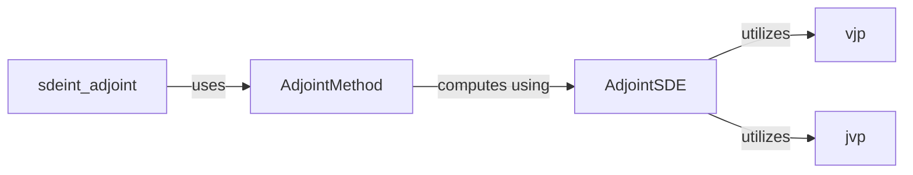

## Details

The `Gradient Computation (Adjoint)` subsystem in `torchsde` is dedicated to efficiently computing gradients for solutions of Stochastic Differential Equations (SDEs) using the adjoint method, integrating deeply with PyTorch's autograd engine.

### sdeint_adjoint
Serves as the high-level API for users to perform SDE integration with adjoint-based gradient computation. It orchestrates the setup of the adjoint solver and manages the forward pass, acting as the primary user-facing function for adjoint SDEs.

**Related Classes/Methods**:

- <a href="https://github.com/google-research/torchsde/blob/master/benchmarks/brownian.py#L158-L164" target="_blank" rel="noopener noreferrer">`sdeint_adjoint`:158-164</a>

### AdjointMethod
A custom `torch.autograd.Function` that defines the forward and backward passes for the adjoint SDE solver. Its `backward` static method is the core of the adjoint gradient computation, encapsulating the adjoint logic and enabling backpropagation through the SDE solution.

**Related Classes/Methods**:

- <a href="https://github.com/google-research/torchsde/blob/master/torchsde/_core/adjoint.py#L29-L127" target="_blank" rel="noopener noreferrer">`AdjointMethod`:29-127</a>

### AdjointSDE
Represents the mathematical formulation of the adjoint SDE. It defines the drift (`f_*`) and diffusion-related (`g_prod*`) terms of the adjoint system based on the original SDE and its derivatives. This is the core computational model for the adjoint system, dynamically adapting to different SDE types.

**Related Classes/Methods**:

- <a href="https://github.com/google-research/torchsde/blob/master/torchsde/_core/adjoint_sde.py#L23-L377" target="_blank" rel="noopener noreferrer">`AdjointSDE`:23-377</a>

### vjp
A utility function for computing the Vector-Jacobian Product (VJP), which is fundamental for reverse-mode automatic differentiation (backpropagation) within the adjoint method. It's a low-level differentiable operation that serves as a building block for gradient computation.

**Related Classes/Methods**:

- <a href="https://github.com/google-research/torchsde/blob/master/torchsde/_core/adjoint_sde.py" target="_blank" rel="noopener noreferrer">`vjp`</a>

### jvp
A utility function for computing the Jacobian-Vector Product (JVP), used in certain adjoint calculations, particularly for forward-mode differentiation components within the adjoint system. It complements `vjp` as another low-level differentiable operation supporting the adjoint method.

**Related Classes/Methods**:

- <a href="https://github.com/google-research/torchsde/blob/master/torchsde/_core/adjoint_sde.py" target="_blank" rel="noopener noreferrer">`jvp`</a>

### [FAQ](https://github.com/CodeBoarding/GeneratedOnBoardings/tree/main?tab=readme-ov-file#faq)