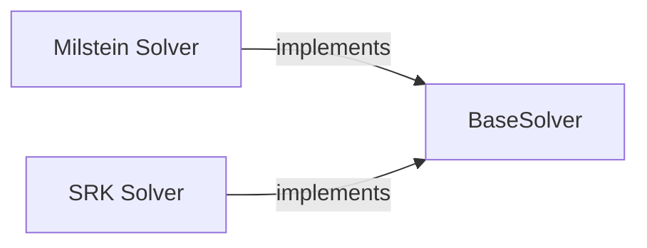

## Details

The `torchsde` library's core numerical integration capabilities are built around an extensible solver framework. At its heart is the `BaseSolver`, an abstract component that defines the fundamental contract for all SDE solvers, ensuring a consistent interface for integration and stepping operations. Concrete implementations, such as the `Milstein Solver` and `SRK Solver`, extend this base, providing specialized algorithms for different stochastic differential equations. This design promotes modularity, allowing for easy addition of new numerical methods while maintaining a unified approach to SDE solving. The interaction pathways primarily involve the concrete solvers implementing and utilizing the methods defined by the `BaseSolver` to perform their respective integration steps.

### BaseSolver
This component serves as the abstract foundation for all SDE numerical integration methods. It establishes the core interface (`integrate`, `step`) and orchestrates the high-level solution process, embodying the "Extensible Framework" pattern. It ensures that all concrete solvers adhere to a common structure, facilitating the addition of new algorithms.

**Related Classes/Methods**:

- <a href="https://github.com/google-research/torchsde/blob/master/torchsde/_core/base_solver.py" target="_blank" rel="noopener noreferrer">`torchsde._core.base_solver`</a>

### Milstein Solver
A concrete implementation of the Milstein numerical method for solving SDEs. This component encapsulates the specific mathematical computations required for a single step of the Milstein algorithm, including handling drift and diffusion terms. It adheres to the `BaseSolver` interface, providing a modular and specialized solver.

**Related Classes/Methods**:

- <a href="https://github.com/google-research/torchsde/blob/master/torchsde/_core/methods/milstein.py" target="_blank" rel="noopener noreferrer">`torchsde._core.methods.milstein`</a>

### SRK Solver
A concrete implementation of the Stochastic Runge-Kutta (SRK) numerical method. Similar to the Milstein solver, it provides the detailed step-by-step computations for the SRK algorithm, potentially adapting to different noise structures. It also implements the `BaseSolver` interface, contributing to the modularity of the solver suite.

**Related Classes/Methods**:

- <a href="https://github.com/google-research/torchsde/blob/master/torchsde/_core/methods/srk.py" target="_blank" rel="noopener noreferrer">`torchsde._core.methods.srk`</a>

### [FAQ](https://github.com/CodeBoarding/GeneratedOnBoardings/tree/main?tab=readme-ov-file#faq)