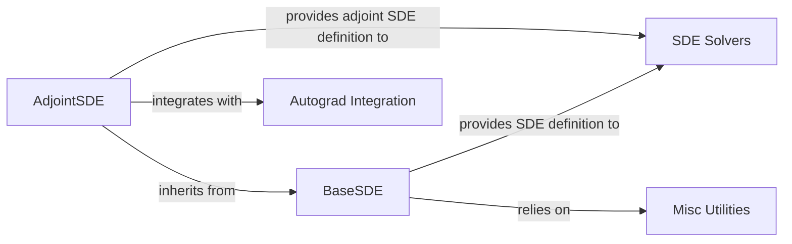

## Details

The `torchsde` core subsystem is built around the abstract definition of Stochastic Differential Equations, primarily through the `BaseSDE` interface. Users define their SDEs by implementing `BaseSDE`, which then provides the necessary drift and diffusion functions to the `SDE Solvers` component for numerical integration. For efficient gradient computation, especially in deep learning contexts, the `AdjointSDE` component extends `BaseSDE` to define the adjoint system. `AdjointSDE` interacts closely with the `Autograd Integration` component, leveraging PyTorch's automatic differentiation capabilities to enable backpropagation through SDE solutions. Additionally, `BaseSDE` utilizes `Misc Utilities` for various supporting functionalities. This architecture ensures a clear separation of concerns, allowing for flexible SDE definition, robust numerical solving, and seamless gradient computation.

### BaseSDE
This is the foundational abstract interface that users implement to define their Stochastic Differential Equations. It provides the core structure and abstract methods (`f` for drift and `g` for diffusion) that must be overridden by concrete SDE models. It serves as the primary user-facing component for specifying the dynamics of a stochastic process.

**Related Classes/Methods**:

- <a href="https://github.com/google-research/torchsde/blob/master/torchsde/_core/base_sde.py" target="_blank" rel="noopener noreferrer">`BaseSDE:f`</a>
- <a href="https://github.com/google-research/torchsde/blob/master/torchsde/_core/base_sde.py" target="_blank" rel="noopener noreferrer">`BaseSDE:g`</a>

### AdjointSDE
A specialized extension of `BaseSDE`, `AdjointSDE` is designed to define and manage the adjoint SDE system. This is crucial for efficiently computing gradients through SDE solvers using the adjoint method. It provides "corrected" and "uncorrected" versions of the drift and diffusion functions (`f_corrected`, `g_corrected`, `f_uncorrected`, `g_uncorrected`) specifically for the adjoint system, enabling backpropagation through SDEs.

**Related Classes/Methods**:

- <a href="https://github.com/google-research/torchsde/blob/master/torchsde/_core/adjoint_sde.py" target="_blank" rel="noopener noreferrer">`AdjointSDE:f_corrected`</a>
- <a href="https://github.com/google-research/torchsde/blob/master/torchsde/_core/adjoint_sde.py" target="_blank" rel="noopener noreferrer">`AdjointSDE:g_corrected`</a>
- <a href="https://github.com/google-research/torchsde/blob/master/torchsde/_core/adjoint_sde.py" target="_blank" rel="noopener noreferrer">`AdjointSDE:f_uncorrected`</a>
- <a href="https://github.com/google-research/torchsde/blob/master/torchsde/_core/adjoint_sde.py" target="_blank" rel="noopener noreferrer">`AdjointSDE:g_uncorrected`</a>

### SDE Solvers
This component encompasses the various numerical integration methods used to solve SDEs. It includes base solver interfaces and concrete implementations for different SDE types (e.g., Euler, Milstein). These solvers take an SDE definition (an instance of `BaseSDE` or `AdjointSDE`) and compute its trajectory over time.

**Related Classes/Methods**:

- <a href="https://github.com/google-research/torchsde/blob/master/torchsde/_core/base_solver.py" target="_blank" rel="noopener noreferrer">`/mnt/e/StartUp/torchsde/torchsde/_core/base_solver.py`</a>
- <a href="https://github.com/google-research/torchsde/blob/master/torchsde/_core/methods/euler.py" target="_blank" rel="noopener noreferrer">`/mnt/e/StartUp/torchsde/torchsde/_core/methods/euler.py`</a>
- <a href="https://github.com/google-research/torchsde/blob/master/torchsde/_core/methods/milstein.py" target="_blank" rel="noopener noreferrer">`/mnt/e/StartUp/torchsde/torchsde/_core/methods/milstein.py`</a>
- <a href="https://github.com/google-research/torchsde/blob/master/torchsde/_core/sdeint.py" target="_blank" rel="noopener noreferrer">`/mnt/e/StartUp/torchsde/torchsde/_core/sdeint.py`</a>

### Misc Utilities
This component groups various helper functions and utilities that support the core SDE functionalities but are not central to the SDE definition or solving process. These might include functions for common mathematical operations, data handling, or other general-purpose tools.

**Related Classes/Methods**:

- <a href="https://github.com/google-research/torchsde/blob/master/torchsde/_core/misc.py" target="_blank" rel="noopener noreferrer">`/mnt/e/StartUp/torchsde/torchsde/_core/misc.py`</a>

### Autograd Integration
This component represents the integration with PyTorch's automatic differentiation (autograd) engine. It is crucial for enabling gradient computation through SDE solutions, particularly when using the adjoint method. It handles the backward pass logic for SDE operations, allowing for end-to-end differentiability.

**Related Classes/Methods**:

- <a href="https://github.com/google-research/torchsde/blob/master/torchsde/_core/adjoint.py" target="_blank" rel="noopener noreferrer">`/mnt/e/StartUp/torchsde/torchsde/_core/adjoint.py`</a>

### [FAQ](https://github.com/CodeBoarding/GeneratedOnBoardings/tree/main?tab=readme-ov-file#faq)