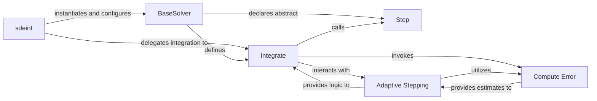

## Details

The `SDE Solver Engine` subsystem is the core orchestrator for integrating Stochastic Differential Equations within `torchsde`. It manages the SDE definition, applies numerical methods, handles adaptive stepping, and initiates adjoint state computations for gradients.

### sdeint
Serves as the main user-facing API. It orchestrates the entire SDE solving process, including input validation, argument parsing, solver instantiation, and delegating the actual integration. It also manages the overall flow for both forward and adjoint computations.

**Related Classes/Methods**:

- <a href="https://github.com/google-research/torchsde/blob/master/torchsde/_core/sdeint.py" target="_blank" rel="noopener noreferrer">`torchsde._core.sdeint`</a>

### BaseSolver
Defines the abstract interface and common methods for all SDE numerical solvers. It provides the `integrate` method, which drives the iterative solution process, and declares the abstract `step` method, which concrete solvers must implement. This component is crucial for the extensibility of the solver engine.

**Related Classes/Methods**:

- <a href="https://github.com/google-research/torchsde/blob/master/torchsde/_core/base_solver.py" target="_blank" rel="noopener noreferrer">`torchsde._core.base_solver.BaseSolver`</a>

### Integrate
Implements the iterative numerical integration loop. This method, part of `BaseSolver`, repeatedly invokes the `step` method of the concrete solver to advance the SDE solution over time. It also incorporates adaptive stepping logic.

**Related Classes/Methods**:

- <a href="https://github.com/google-research/torchsde/blob/master/torchsde/_core/base_solver.py" target="_blank" rel="noopener noreferrer">`torchsde._core.base_solver.BaseSolver:integrate`</a>

### Step
(Abstract in `BaseSolver`) Performs a single, atomic step of the SDE integration process. This is where the specific numerical method (e.g., Euler-Maruyama, Milstein) is applied to compute the next state based on the current state, SDE function, and Brownian motion.

**Related Classes/Methods**:

- <a href="https://github.com/google-research/torchsde/blob/master/torchsde/_core/base_solver.py" target="_blank" rel="noopener noreferrer">`torchsde._core.base_solver.BaseSolver:step`</a>

### Adaptive Stepping
Manages the dynamic adjustment of integration step sizes. It uses error estimates to balance accuracy and computational efficiency, ensuring the solver takes appropriate steps.

**Related Classes/Methods**:

- <a href="https://github.com/google-research/torchsde/blob/master/torchsde/_core/adaptive_stepping.py" target="_blank" rel="noopener noreferrer">`torchsde._core.adaptive_stepping`</a>

### Compute Error
Quantifies the local error of an integration step. This error estimate is fundamental for adaptive step-sizing algorithms to determine if a step was accurate enough or if it needs to be recomputed with a smaller step size.

**Related Classes/Methods**:

- <a href="https://github.com/google-research/torchsde/blob/master/torchsde/_core/adaptive_stepping.py" target="_blank" rel="noopener noreferrer">`torchsde._core.adaptive_stepping`</a>

### [FAQ](https://github.com/CodeBoarding/GeneratedOnBoardings/tree/main?tab=readme-ov-file#faq)