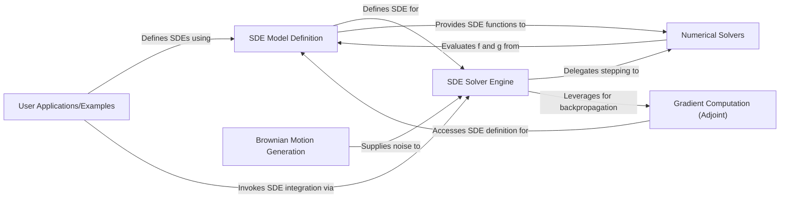

## Details

The `torchsde` architecture is designed as a modular ML toolkit for differentiable SDE solving. At its core, the **SDE Solver Engine** orchestrates the numerical integration of SDEs, receiving SDE definitions from the **SDE Model Definition** component and stochastic noise from **Brownian Motion Generation**. The engine delegates the actual computation to various **Numerical Solvers** and, crucially for deep learning, leverages the **Gradient Computation (Adjoint)** component for efficient backpropagation. This design allows **User Applications/Examples** to seamlessly define and solve SDEs while benefiting from PyTorch's autograd capabilities, making `torchsde` a flexible and powerful tool for SDE-based machine learning models.

### SDE Model Definition [[Expand]](./SDE_Model_Definition.md)
Provides the abstract interface for users to define their SDEs, specifying the drift (`f`) and diffusion (`g`) functions. This component is central to how users interact with the library to describe their stochastic processes.

**Related Classes/Methods**:

- <a href="https://github.com/google-research/torchsde/blob/master/torchsde/_core/base_sde.py" target="_blank" rel="noopener noreferrer">`torchsde._core.base_sde`</a>
- <a href="https://github.com/google-research/torchsde/blob/master/torchsde/_core/adjoint_sde.py" target="_blank" rel="noopener noreferrer">`torchsde._core.adjoint_sde`</a>

### Brownian Motion Generation [[Expand]](./Brownian_Motion_Generation.md)
Manages the generation, interpolation, and access patterns for the stochastic noise (Brownian motion) required by SDEs. It ensures that the noise is available to the solver as needed.

**Related Classes/Methods**:

- <a href="https://github.com/google-research/torchsde/blob/master/torchsde/_brownian/brownian_interval.py" target="_blank" rel="noopener noreferrer">`torchsde._brownian.brownian_interval`</a>
- <a href="https://github.com/google-research/torchsde/blob/master/torchsde/_brownian/derived.py" target="_blank" rel="noopener noreferrer">`torchsde._brownian.derived`</a>

### SDE Solver Engine [[Expand]](./SDE_Solver_Engine.md)
The core orchestrator of the SDE integration process. It takes the SDE definition and Brownian motion, applies numerical methods, and manages adaptive stepping. It also initiates the adjoint state computation for gradients.

**Related Classes/Methods**:

- <a href="https://github.com/google-research/torchsde/blob/master/torchsde/_core/sdeint.py" target="_blank" rel="noopener noreferrer">`torchsde._core.sdeint`</a>
- <a href="https://github.com/google-research/torchsde/blob/master/torchsde/_core/base_solver.py" target="_blank" rel="noopener noreferrer">`torchsde._core.base_solver`</a>
- <a href="https://github.com/google-research/torchsde/blob/master/torchsde/_core/adaptive_stepping.py" target="_blank" rel="noopener noreferrer">`torchsde._core.adaptive_stepping`</a>

### Numerical Solvers [[Expand]](./Numerical_Solvers.md)
Contains the implementations of various numerical algorithms for integrating SDEs (e.g., Milstein, SRK). These solvers perform the actual step-by-step computation based on the SDE's drift and diffusion functions.

**Related Classes/Methods**:

- <a href="https://github.com/google-research/torchsde/blob/master/torchsde/_core/methods/milstein.py" target="_blank" rel="noopener noreferrer">`torchsde._core.methods.milstein`</a>
- <a href="https://github.com/google-research/torchsde/blob/master/torchsde/_core/methods/srk.py" target="_blank" rel="noopener noreferrer">`torchsde._core.methods.srk`</a>

### Gradient Computation (Adjoint) [[Expand]](./Gradient_Computation_Adjoint_.md)
Implements the adjoint method for efficient and memory-conscious gradient computation through SDE solutions. This component is critical for integrating `torchsde` into deep learning models that rely on backpropagation. It utilizes low-level autograd utilities.

**Related Classes/Methods**:

- <a href="https://github.com/google-research/torchsde/blob/master/torchsde/_core/adjoint.py" target="_blank" rel="noopener noreferrer">`torchsde._core.adjoint`</a>
- <a href="https://github.com/google-research/torchsde/blob/master/torchsde/_core/misc.py" target="_blank" rel="noopener noreferrer">`torchsde._core.misc`</a>

### User Applications/Examples
Demonstrates practical use cases and integration of the `torchsde` library within various machine learning models (e.g., DDPM, Latent SDEs, SDE-GANs). These are external components that showcase the library's capabilities.

**Related Classes/Methods**:

- <a href="https://github.com/google-research/torchsde/blob/master/examples/cont_ddpm.py" target="_blank" rel="noopener noreferrer">`examples.cont_ddpm`</a>
- <a href="https://github.com/google-research/torchsde/blob/master/examples/latent_sde.py" target="_blank" rel="noopener noreferrer">`examples.latent_sde`</a>
- <a href="https://github.com/google-research/torchsde/blob/master/examples/sde_gan.py" target="_blank" rel="noopener noreferrer">`examples.sde_gan`</a>
- <a href="https://github.com/google-research/torchsde/blob/master/examples/unet.py" target="_blank" rel="noopener noreferrer">`examples.unet`</a>

### [FAQ](https://github.com/CodeBoarding/GeneratedOnBoardings/tree/main?tab=readme-ov-file#faq)