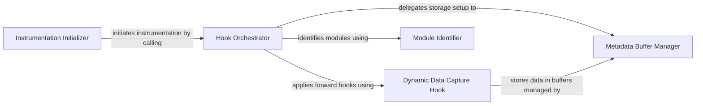

## Details

The `Model Instrumentation` subsystem in `torchstat` is designed to dynamically analyze PyTorch models by injecting hooks into their forward pass. This process captures crucial layer-specific metadata, forming the foundation for subsequent metric calculations. It aligns with the "Model Input/Loader" and initial "Metric Calculation Module" patterns of an ML Toolkit/Utility.

### Instrumentation Initializer
Serves as the primary entry point for setting up the model instrumentation. It takes the PyTorch model and an input shape, then orchestrates the process of identifying target modules and applying the necessary hooks for data collection. It prepares the model for analysis, acting as part of the "Model Input/Loader."

**Related Classes/Methods**:

- <a href="https://github.com/Swall0w/torchstat/blob/master/torchstat/model_hook.py" target="_blank" rel="noopener noreferrer">`torchstat.model_hook:__init__`</a>

### Hook Orchestrator
Contains the core logic for iterating through identified modules and applying the forward hooks. It ensures that each relevant sub-module is instrumented to capture its operational metadata during execution, forming a central part of the "Metric Calculation Module" by setting up the data collection mechanism.

**Related Classes/Methods**:

- <a href="https://github.com/Swall0w/torchstat/blob/master/torchstat/model_hook.py" target="_blank" rel="noopener noreferrer">`torchstat.model_hook:_hook_model`</a>

### Dynamic Data Capture Hook
This is the actual callback function registered as a forward hook. It intercepts a module's execution, captures real-time data like input/output tensor shapes, and stores this information for later analysis. It directly implements the data capture aspect of the "Metric Calculation Module."

**Related Classes/Methods**:

- <a href="https://github.com/Swall0w/torchstat/blob/master/torchstat/model_hook.py" target="_blank" rel="noopener noreferrer">`torchstat.model_hook:_sub_module_call_hook`</a>

### Metadata Buffer Manager
Manages the creation and registration of PyTorch buffers within the model. These buffers are used to persistently store the collected intermediate data (e.g., tensor shapes, module types, parameter counts), making it accessible after the model's forward pass completes. It supports the "Metric Calculation Modules" by providing the storage mechanism for raw data.

**Related Classes/Methods**:

- <a href="https://github.com/Swall0w/torchstat/blob/master/torchstat/model_hook.py" target="_blank" rel="noopener noreferrer">`torchstat.model_hook:_register_buffer`</a>

### Module Identifier
Identifies and returns the "leaf" modules of the PyTorch model. These are the lowest-level computational units typically targeted for instrumentation to gather granular data. It supports the "Model Input/Loader" by preparing the model structure for targeted analysis.

**Related Classes/Methods**:

- <a href="https://github.com/Swall0w/torchstat/blob/master/torchstat/model_hook.py" target="_blank" rel="noopener noreferrer">`torchstat.model_hook:retrieve_leaf_modules`</a>

### [FAQ](https://github.com/CodeBoarding/GeneratedOnBoardings/tree/main?tab=readme-ov-file#faq)