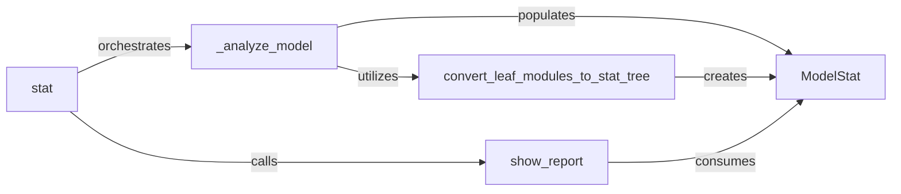

## Details

The `Statistics Aggregation & Orchestration` subsystem is primarily defined by the `torchstat.statistics` module and its contained classes and functions. This subsystem acts as the central control and data processing unit for the neural network analysis pipeline.

### stat
Acts as the public API and central orchestrator for the entire model analysis pipeline. It takes a PyTorch model and input tensor, initiates the analysis, and coordinates the generation and display of the final report.

**Related Classes/Methods**:

- <a href="https://github.com/Swall0w/torchstat/blob/master/torchstat/statistics.py#L69-L71" target="_blank" rel="noopener noreferrer">`torchstat.statistics.stat`:69-71</a>

### _analyze_model
Manages the internal steps of model analysis. This includes traversing the model's modules, collecting raw data, and initiating the conversion of this data into a structured statistical representation using `ModelStat` objects.

**Related Classes/Methods**:

- <a href="https://github.com/Swall0w/torchstat/blob/master/torchstat/statistics.py#L56-L61" target="_blank" rel="noopener noreferrer">`torchstat.statistics._analyze_model`:56-61</a>

### ModelStat
Serves as the primary data structure for holding and aggregating statistical information (e.g., FLOPs, parameters, memory) for a specific module or a collection of modules within the neural network. Instances of `ModelStat` form the nodes of the hierarchical statistical tree.

**Related Classes/Methods**:

- <a href="https://github.com/Swall0w/torchstat/blob/master/torchstat/statistics.py#L48-L66" target="_blank" rel="noopener noreferrer">`torchstat.statistics.ModelStat`:48-66</a>

### convert_leaf_modules_to_stat_tree
Transforms the flat list of individual PyTorch modules (leaf modules) into a hierarchical tree structure composed of `ModelStat` objects. This is crucial for representing the nested nature of neural networks and aggregating statistics at different levels.

**Related Classes/Methods**:

- <a href="https://github.com/Swall0w/torchstat/blob/master/torchstat/statistics.py#L21-L45" target="_blank" rel="noopener noreferrer">`torchstat.statistics.convert_leaf_modules_to_stat_tree`:21-45</a>

### show_report
Takes the processed statistical data (represented by the `ModelStat` tree) and presents it in a human-readable format, typically a tabular report. It handles the final output formatting and display logic.

**Related Classes/Methods**:

- <a href="https://github.com/Swall0w/torchstat/blob/master/torchstat/statistics.py#L63-L66" target="_blank" rel="noopener noreferrer">`torchstat.statistics.show_report`:63-66</a>

### [FAQ](https://github.com/CodeBoarding/GeneratedOnBoardings/tree/main?tab=readme-ov-file#faq)