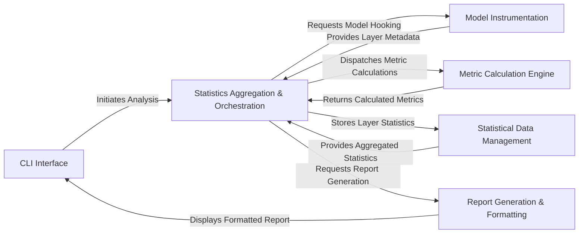

## Details

The `torchstat` architecture is designed as a modular pipeline for comprehensive neural network analysis. It begins with the **CLI Interface** handling user input and initiating the analysis flow. The central **Statistics Aggregation & Orchestration** component then takes charge, first leveraging the **Model Instrumentation** to extract detailed layer-wise information from the target PyTorch model. This information is subsequently fed to the **Metric Calculation Engine**, which computes various performance metrics like FLOPs, memory usage, and MADDs. All collected and calculated statistics are meticulously organized and managed by the **Statistical Data Management** component. Finally, the aggregated data is passed to the **Report Generation & Formatting** component, which transforms it into a clear, human-readable report for display back to the user via the **CLI Interface**. This pipeline ensures a clear separation of concerns, enabling extensibility for new metrics and reporting formats, making it ideal for visual representation as a sequential data processing flow.

### CLI Interface
Serves as the primary user entry point, responsible for parsing command-line arguments, configuring the analysis, and initiating the overall process. It also acts as the final display medium for the generated reports.

**Related Classes/Methods**:

- <a href="https://github.com/Swall0w/torchstat/blob/master/torchstat/__main__.py" target="_blank" rel="noopener noreferrer">`torchstat.__main__`</a>

### Model Instrumentation [[Expand]](./Model_Instrumentation.md)
Dynamically hooks into a PyTorch model's forward pass to capture essential layer-specific metadata, such as input/output tensor shapes and module types. This information is crucial for subsequent metric calculations.

**Related Classes/Methods**:

- <a href="https://github.com/Swall0w/torchstat/blob/master/torchstat/model_hook.py" target="_blank" rel="noopener noreferrer">`torchstat.model_hook`</a>

### Metric Calculation Engine
A modular collection of specialized functions designed to compute various performance metrics (FLOPs, Memory, MADDs) for different types of neural network layers. This component acts as a pluggable engine, allowing for extensible analytical capabilities.

**Related Classes/Methods**:

- <a href="https://github.com/Swall0w/torchstat/blob/master/torchstat/compute_flops.py" target="_blank" rel="noopener noreferrer">`torchstat.compute_flops`</a>
- <a href="https://github.com/Swall0w/torchstat/blob/master/torchstat/compute_memory.py" target="_blank" rel="noopener noreferrer">`torchstat.compute_memory`</a>
- <a href="https://github.com/Swall0w/torchstat/blob/master/torchstat/compute_madd.py" target="_blank" rel="noopener noreferrer">`torchstat.compute_madd`</a>

### Statistics Aggregation & Orchestration [[Expand]](./Statistics_Aggregation_Orchestration.md)
The central control module of the analysis pipeline. It orchestrates the entire process by coordinating model instrumentation, dispatching calls to the Metric Calculation Engine, aggregating the results from various calculations, and preparing the consolidated data for reporting.

**Related Classes/Methods**:

- <a href="https://github.com/Swall0w/torchstat/blob/master/torchstat/statistics.py" target="_blank" rel="noopener noreferrer">`torchstat.statistics`</a>

### Statistical Data Management
Manages a hierarchical data structure (StatTree) that efficiently stores, organizes, and allows for granular updates of the collected statistics for each module and submodule within the neural network.

**Related Classes/Methods**:

- <a href="https://github.com/Swall0w/torchstat/blob/master/torchstat/stat_tree.py" target="_blank" rel="noopener noreferrer">`torchstat.stat_tree`</a>

### Report Generation & Formatting [[Expand]](./Report_Generation_Formatting.md)
Takes the aggregated statistical data from the Statistics Aggregation & Orchestration component and formats it into a human-readable report, typically presented in a tabular or structured text format suitable for display to the user.

**Related Classes/Methods**:

- <a href="https://github.com/Swall0w/torchstat/blob/master/torchstat/reporter.py" target="_blank" rel="noopener noreferrer">`torchstat.reporter`</a>

### [FAQ](https://github.com/CodeBoarding/GeneratedOnBoardings/tree/main?tab=readme-ov-file#faq)