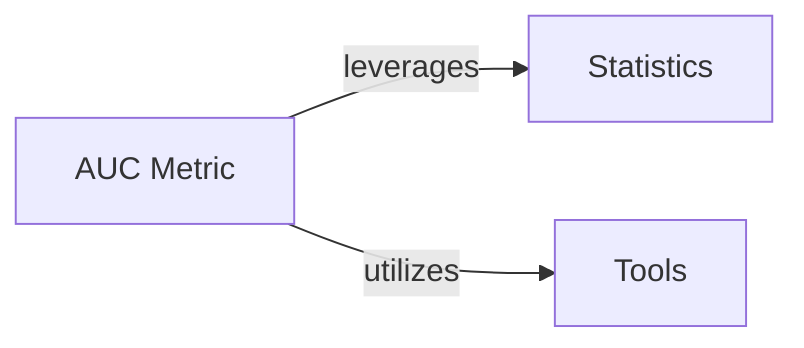

## Details

This analysis describes the `AUC Metric` component, its role in survival model evaluation, and its dependencies on `Statistics` and `Tools` components for robust and accurate calculations.

### AUC Metric [[Expand]](./AUC_Metric.md)
This component is responsible for calculating the Area Under the Curve (AUC) for survival models, a common metric for evaluating discriminatory power. It assesses how well the model distinguishes between individuals who experience an event and those who do not, based on their predicted survival probabilities. Specifically, it implements time-dependent AUC (cumulative/dynamic and incident/dynamic) and supports censoring-adjusted AUC using Inverse Probability of Censoring Weighting (IPCW).

**Related Classes/Methods**:

- <a href="https://github.com/Novartis/torchsurv/src/torchsurv/metrics/auc.py#L12-L1283" target="_blank" rel="noopener noreferrer">`torchsurv.metrics.auc.Auc` (12:1283)</a>

### Statistics [[Expand]](./Statistics.md)
The `Statistics` component provides statistical methods, particularly for Inverse Probability of Censoring Weighting (IPCW) and Kaplan-Meier estimation, essential for handling censored data and providing unbiased AUC estimates.

**Related Classes/Methods**:

- <a href="https://github.com/Novartis/torchsurv/src/torchsurv/stats/kaplan_meier.py#L0-L0" target="_blank" rel="noopener noreferrer">`torchsurv.stats.kaplan_meier` (0:0)</a>

### Tools
The `Tools` component is used for input validation, ensuring that data passed to the `Auc` class is in the correct format and meets necessary constraints.

**Related Classes/Methods**: _None_

### [FAQ](https://github.com/CodeBoarding/GeneratedOnBoardings/tree/main?tab=readme-ov-file#faq)