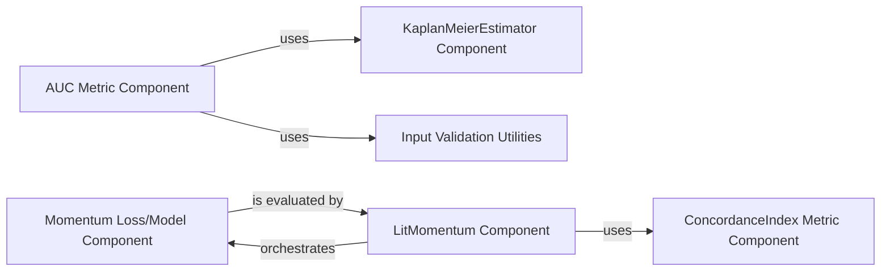

## Details

Component overview for the `AUC Metric Component` and related components within the `torchsurv` project.

### AUC Metric Component [[Expand]](./AUC_Metric_Component.md)
This component, implemented by the `Auc` class, is a comprehensive tool for calculating, validating, and statistically analyzing the Area Under the Curve (AUC) for survival data. It supports both cumulative/dynamic and incident/dynamic AUC. Its core functionalities include computing time-dependent AUC, integrating AUC over time, determining confidence intervals (using Blanche's method or bootstrapping), calculating p-values for hypothesis testing (e.g., AUC = 0.5), and facilitating statistical comparisons between two AUCs. It handles input validation, data preparation (sorting, expanding tensors), and incorporates inverse probability weighting for censoring adjustment.

**Related Classes/Methods**:

- <a href="https://github.com/Novartis/torchsurv/src/torchsurv/metrics/auc.py#L12-L1283" target="_blank" rel="noopener noreferrer">`Auc` (12:1283)</a>

### ConcordanceIndex Metric Component
This component, represented by the `ConcordanceIndex` class, is a metric used to evaluate the performance of survival models. It calculates the concordance index (C-index), a common measure for ranking accuracy in survival analysis, indicating the model's ability to correctly rank subjects based on their survival times.

**Related Classes/Methods**:

- `ConcordanceIndex` (1:1)

### KaplanMeierEstimator Component
This component provides functionality for estimating survival distributions using the Kaplan-Meier method. It is a fundamental statistical tool in survival analysis, used to calculate the probability of survival past a certain time point, especially in the presence of censored data.

**Related Classes/Methods**:

- `KaplanMeierEstimator` (1:1)

### Input Validation Utilities
This component, represented by the `validate_inputs` module, provides utility functions for validating the format and content of input data used across various `torchsurv` components. This ensures data integrity and prevents errors in downstream calculations, promoting robustness and reliability.

**Related Classes/Methods**:

- <a href="https://github.com/Novartis/torchsurv/src/torchsurv/tools/validate_inputs.py#L1-L1" target="_blank" rel="noopener noreferrer">`validate_inputs` (1:1)</a>

### Momentum Loss/Model Component
This component, implemented by the `Momentum` class, appears to define a specific loss function or a core part of a survival model that utilizes a momentum mechanism. Its internal methods (`_init_encoder_k`, `_bank_loss`, `_update_momentum_encoder`) suggest it manages an encoder and a memory bank, which are characteristic of momentum-based learning approaches, particularly relevant in survival analysis contexts for self-supervised learning or contrastive learning.

**Related Classes/Methods**:

- <a href="https://github.com/Novartis/torchsurv/src/torchsurv/loss/momentum.py#L9-L212" target="_blank" rel="noopener noreferrer">`Momentum` (9:212)</a>

### LitMomentum Component
This component, likely a PyTorch Lightning module, is responsible for orchestrating the training, validation, and testing steps of a survival model that incorporates a momentum mechanism. It initializes and utilizes the `ConcordanceIndex` for performance evaluation during these phases, acting as a high-level coordinator for the model's lifecycle within a PyTorch Lightning framework.

**Related Classes/Methods**:

- `LitMomentum` (1:1)

### [FAQ](https://github.com/CodeBoarding/GeneratedOnBoardings/tree/main?tab=readme-ov-file#faq)