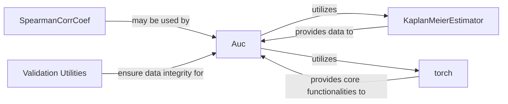

## Details

Analysis of the `Auc` subsystem in `torchsurv`, detailing its core components and their interdependencies for calculating time-dependent AUC, including survival probability estimation, PyTorch integration, and input validation.

### Auc [[Expand]](./Auc.md)
The central component responsible for calculating time-dependent AUC. It orchestrates the entire AUC computation process, including handling different AUC types (cumulative/dynamic, incident/dynamic), confidence interval methods (Blanche, Bootstrap), p-value calculations, and comparisons. It acts as the main interface for users to compute AUC.

**Related Classes/Methods**:

- <a href="https://github.com/Novartis/torchsurv/src/torchsurv/metrics/auc.py#L12-L1283" target="_blank" rel="noopener noreferrer">`torchsurv.metrics.auc.Auc` (12:1283)</a>

### KaplanMeierEstimator [[Expand]](./KaplanMeierEstimator.md)
This component is responsible for estimating the survival function using the Kaplan-Meier method. In the context of `Auc`, it is likely used to compute the inverse probability of censoring weights (IPCW), which are essential for unbiased AUC estimation in the presence of censored data.

**Related Classes/Methods**: _None_

### torch
The fundamental deep learning framework that `Auc` heavily relies on. It provides the core tensor operations, automatic differentiation capabilities, and GPU acceleration, which are critical for the performance and scalability of AUC computations, especially with large datasets.

**Related Classes/Methods**: _None_

### SpearmanCorrCoef
A metric component for calculating the Spearman's rank correlation coefficient. While its direct role in the core AUC calculation is not immediately obvious without deeper code inspection, its presence in the "utilizes" list suggests it might be used for specific internal validation, a specialized AUC variant, or a related statistical test within the `Auc` class's broader functionalities.

**Related Classes/Methods**: _None_

### Validation Utilities
A collection of internal helper functions or methods within the `Auc` class (or a related utility module) responsible for validating the input data and parameters. These utilities ensure that the inputs to the AUC calculation are in the correct format, type, and range, preventing errors and ensuring the robustness of the `Auc` component.

**Related Classes/Methods**:

- <a href="https://github.com/Novartis/torchsurv/src/torchsurv/metrics/auc.py#L1191-L1212" target="_blank" rel="noopener noreferrer">`torchsurv.metrics.auc.Auc:_validate_auc_inputs` (1191:1212)</a>

### [FAQ](https://github.com/CodeBoarding/GeneratedOnBoardings/tree/main?tab=readme-ov-file#faq)