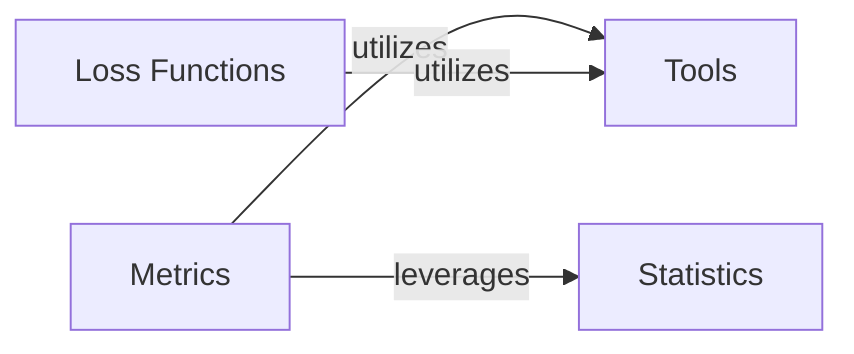

## Details

The torchsurv library is structured around four fundamental components (Loss Functions, Metrics, Statistics, and Tools) that collectively enable the training, evaluation, and statistical handling of survival models. The Brier Score Metric is a specialized part of the Metrics component, dedicated to evaluating the prediction accuracy of survival models.

### Loss Functions [[Expand]](./Loss_Functions.md)
This component provides various loss functions (e.g., Cox, Momentum, Weibull) essential for training survival models. These functions quantify the discrepancy between predicted and actual survival outcomes, guiding the model's learning process.

**Related Classes/Methods**:

- <a href="https://github.com/Novartis/torchsurv/src/torchsurv/loss/cox.py#L1-L1" target="_blank" rel="noopener noreferrer">`torchsurv.loss.cox` (1:1)</a>
- <a href="https://github.com/Novartis/torchsurv/src/torchsurv/loss/momentum.py#L1-L1" target="_blank" rel="noopener noreferrer">`torchsurv.loss.momentum` (1:1)</a>
- <a href="https://github.com/Novartis/torchsurv/src/torchsurv/loss/weibull.py#L1-L1" target="_blank" rel="noopener noreferrer">`torchsurv.loss.weibull` (1:1)</a>

### Metrics [[Expand]](./Metrics.md)
This component offers a suite of evaluation metrics specifically tailored for survival analysis, including AUC, C-index, and the Brier Score. These metrics are used to assess the performance and accuracy of survival models. The Brier Score Metric is a key part of this component, dedicated to calculating the Brier Score for prediction accuracy, handling survival data, event times, and predictions, often with considerations for censoring and time-dependency.

**Related Classes/Methods**:

- <a href="https://github.com/Novartis/torchsurv/src/torchsurv/metrics/auc.py#L1-L1" target="_blank" rel="noopener noreferrer">`torchsurv.metrics.auc` (1:1)</a>
- <a href="https://github.com/Novartis/torchsurv/src/torchsurv/metrics/brier_score.py#L1-L1" target="_blank" rel="noopener noreferrer">`torchsurv.metrics.brier_score` (1:1)</a>
- <a href="https://github.com/Novartis/torchsurv/src/torchsurv/metrics/cindex.py#L1-L1" target="_blank" rel="noopener noreferrer">`torchsurv.metrics.cindex` (1:1)</a>

### Statistics [[Expand]](./Statistics.md)
This component provides statistical utilities relevant to survival analysis, such as methods for Inverse Probability of Censoring Weighting (IPCW) and Kaplan-Meier estimation. These are often used for data preparation, analysis, or in conjunction with model evaluation, particularly for metrics like the Brier Score, which may require handling censored data.

**Related Classes/Methods**:

- <a href="https://github.com/Novartis/torchsurv/src/torchsurv/stats/ipcw.py#L1-L1" target="_blank" rel="noopener noreferrer">`torchsurv.stats.ipcw` (1:1)</a>
- <a href="https://github.com/Novartis/torchsurv/src/torchsurv/stats/kaplan_meier.py#L1-L1" target="_blank" rel="noopener noreferrer">`torchsurv.stats.kaplan_meier` (1:1)</a>

### Tools
This component contains utility functions that support other parts of the torchsurv library. Specifically, it includes input validation routines to ensure that data passed to other components meets the expected format and constraints, promoting robust data handling across the library.

**Related Classes/Methods**:

- <a href="https://github.com/Novartis/torchsurv/src/torchsurv/tools/validate_inputs.py#L1-L1" target="_blank" rel="noopener noreferrer">`torchsurv.tools.validate_inputs` (1:1)</a>

### [FAQ](https://github.com/CodeBoarding/GeneratedOnBoardings/tree/main?tab=readme-ov-file#faq)