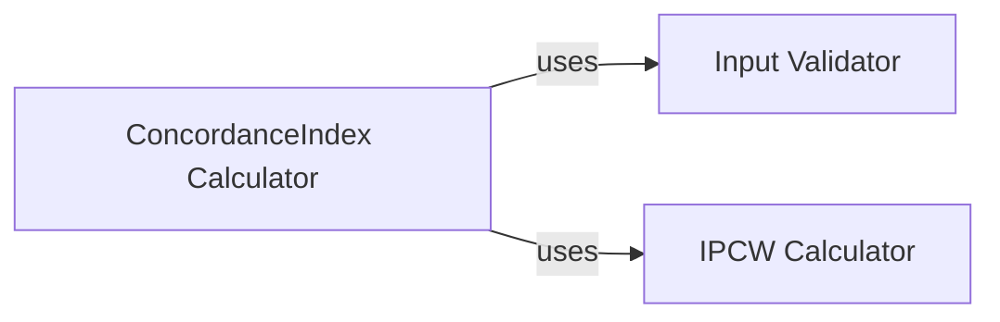

## Details

Component Overview for `ConcordanceIndex` Subsystem

### ConcordanceIndex Calculator [[Expand]](./ConcordanceIndex_Calculator.md)
This is the central component responsible for computing the Concordance Index (C-index). It handles the core logic for calculating concordance, discordance, and tied pairs, incorporating Inverse Probability of Censoring Weighting (IPCW) if provided. Beyond basic C-index computation, it offers robust statistical functionalities, including calculating confidence intervals (using Noether, Conservative, or Bootstrap methods), p-values for hypothesis testing (against a null of 0.5), and comparative analysis between two C-index values.

**Related Classes/Methods**:

- <a href="https://github.com/Novartis/torchsurv/src/torchsurv/metrics/cindex.py#L12-L910" target="_blank" rel="noopener noreferrer">`torchsurv.metrics.cindex.ConcordanceIndex` (12:910)</a>

### Input Validator
This component ensures the integrity and correctness of input data (event status, time-to-event, and risk estimates) before they are processed by the ConcordanceIndex Calculator. It performs checks on data types, shapes, and values to prevent computational errors and ensure reliable C-index calculations.

**Related Classes/Methods**:

- <a href="https://github.com/Novartis/torchsurv/src/torchsurv/tools/validate_inputs.py#L3-L37" target="_blank" rel="noopener noreferrer">`torchsurv.tools.validate_inputs.validate_survival_data` (3:37)</a>
- <a href="https://github.com/Novartis/torchsurv/src/torchsurv/tools/validate_inputs.py#L86-L120" target="_blank" rel="noopener noreferrer">`torchsurv.tools.validate_inputs.validate_estimate` (86:120)</a>

### IPCW Calculator [[Expand]](./IPCW_Calculator.md)
This component is responsible for calculating Inverse Probability of Censoring Weights (IPCW). These weights are crucial for adjusting the C-index calculation in the presence of censored data, as recommended by Uno et al. (2011), to provide a more robust and unbiased estimate of the concordance index.

**Related Classes/Methods**:

- <a href="https://github.com/Novartis/torchsurv/src/torchsurv/stats/ipcw.py#L11-L76" target="_blank" rel="noopener noreferrer">`torchsurv.stats.ipcw.get_ipcw` (11:76)</a>

### [FAQ](https://github.com/CodeBoarding/GeneratedOnBoardings/tree/main?tab=readme-ov-file#faq)