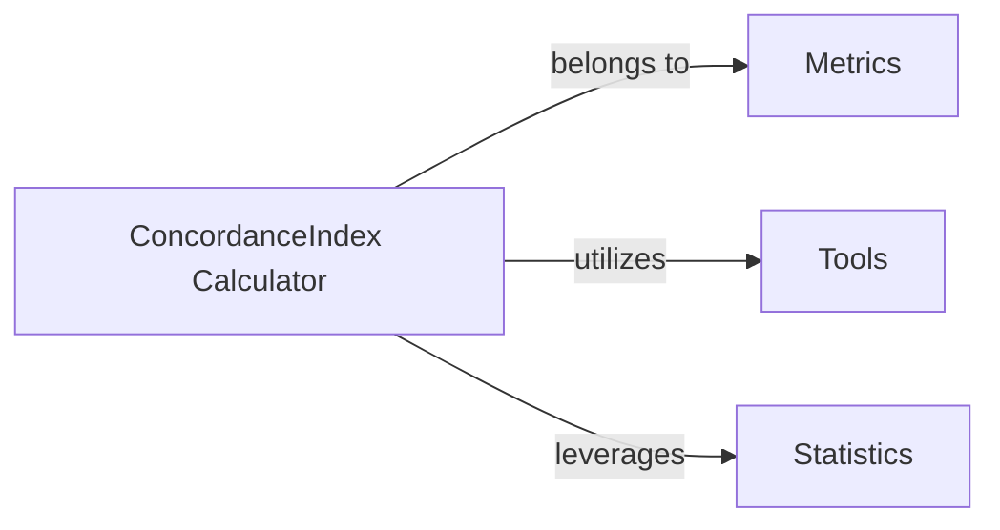

## Details

The `ConcordanceIndex Calculator` component is fundamental because it encapsulates the entire logic for computing the Concordance Index (C-index), a critical metric in survival analysis. Its importance stems from its comprehensive functionality, which includes not only the core C-index calculation but also advanced statistical features like confidence interval estimation, p-value calculation, and comparative analysis. This makes it a self-contained and robust unit for evaluating survival models.

### ConcordanceIndex Calculator [[Expand]](./ConcordanceIndex_Calculator.md)
This component is the core implementation for computing the Concordance Index (C-index), a key metric for evaluating survival models. It manages the intricate logic for identifying comparable pairs, handling tied event times and risk scores, and calculating the C-index estimate. Beyond the primary calculation, it provides robust statistical functionalities, including methods for estimating confidence intervals (using Noether, Bootstrap, and Conservative approaches), calculating p-values, and performing statistical comparisons between two C-index values. It maintains internal state related to the C-index calculation (e.g., `concordant`, `discordant`, `tied_risk`, `weight`).

**Related Classes/Methods**: _None_

### Metrics [[Expand]](./Metrics.md)

**Related Classes/Methods**: _None_

### Tools

**Related Classes/Methods**: _None_

### Statistics [[Expand]](./Statistics.md)

**Related Classes/Methods**: _None_

### [FAQ](https://github.com/CodeBoarding/GeneratedOnBoardings/tree/main?tab=readme-ov-file#faq)