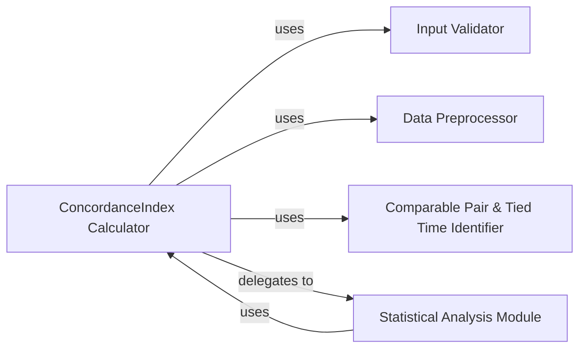

## Details

This analysis describes the components and their relationships within a Concordance Index (C-index) calculation subsystem. The core `ConcordanceIndex Calculator` orchestrates data validation, preprocessing, pair identification, and delegates statistical analysis to a dedicated module. The components are chosen to ensure clear separation of concerns, promoting maintainability, testability, and extensibility.

### ConcordanceIndex Calculator [[Expand]](./ConcordanceIndex_Calculator.md)
This is the central component responsible for computing the Concordance Index (C-index). It encapsulates the core logic for calculating concordance, discordance, and tied pairs, with support for Inverse Probability of Censoring Weighting (IPCW). Beyond basic C-index computation, it provides robust statistical functionalities, including the calculation of confidence intervals (using Noether, Conservative, or Bootstrap methods), p-values for hypothesis testing (against a null of 0.5), and comparative analysis between two C-index values.

**Related Classes/Methods**:

- <a href="https://github.com/Novartis/torchsurv/src/torchsurv/metrics/cindex.py#L0-L0" target="_blank" rel="noopener noreferrer">`torchsurv.metrics.cindex` (0:0)</a>

### Input Validator
This component provides essential utility functions for validating the format and correctness of input data, specifically survival data (time and event status) and model estimates. Its primary role is to ensure that data conforms to expected types and structures before being processed by the `ConcordanceIndex Calculator`, thereby preventing errors and ensuring the reliability of computations.

**Related Classes/Methods**:

- `torchsurv.metrics.validate_inputs` (0:0)

### Data Preprocessor
This component is responsible for preparing and formatting the input data for C-index calculation. This includes ensuring that risk estimates are in the correct tensor shape and applying or generating appropriate sample weights, such as those derived from Inverse Probability of Censoring Weighting (IPCW).

**Related Classes/Methods**:

- <a href="https://github.com/Novartis/torchsurv/src/torchsurv/metrics/cindex.py#L0-L0" target="_blank" rel="noopener noreferrer">`torchsurv.metrics.cindex:_update_cindex_estimate` (0:0)</a>
- <a href="https://github.com/Novartis/torchsurv/src/torchsurv/metrics/cindex.py#L0-L0" target="_blank" rel="noopener noreferrer">`torchsurv.metrics.cindex:_update_weight` (0:0)</a>

### Comparable Pair & Tied Time Identifier
This component's purpose is to accurately identify comparable pairs of samples within the survival data and to account for instances where event times are tied. This identification is a critical prerequisite for the correct calculation of concordant, discordant, and tied risk pairs in the C-index formula.

**Related Classes/Methods**:

- <a href="https://github.com/Novartis/torchsurv/src/torchsurv/metrics/cindex.py#L0-L0" target="_blank" rel="noopener noreferrer">`torchsurv.metrics.cindex:_get_comparable_and_tied_time` (0:0)</a>

### Statistical Analysis Module
This module provides a comprehensive suite of statistical methods for analyzing the computed Concordance Index. It includes functionalities for calculating confidence intervals using various statistical approaches (Noether, Conservative, Bootstrap), determining p-values for hypothesis testing against a null C-index of 0.5, and performing comparative analyses between two C-index values. It also handles the computation of the standard error for the C-index.

**Related Classes/Methods**:

- <a href="https://github.com/Novartis/torchsurv/src/torchsurv/metrics/cindex.py#L0-L0" target="_blank" rel="noopener noreferrer">`torchsurv.metrics.cindex:_confidence_interval_noether` (0:0)</a>
- <a href="https://github.com/Novartis/torchsurv/src/torchsurv/metrics/cindex.py#L0-L0" target="_blank" rel="noopener noreferrer">`torchsurv.metrics.cindex:_confidence_interval_conservative` (0:0)</a>
- <a href="https://github.com/Novartis/torchsurv/src/torchsurv/metrics/cindex.py#L0-L0" target="_blank" rel="noopener noreferrer">`torchsurv.metrics.cindex:_confidence_interval_bootstrap` (0:0)</a>
- <a href="https://github.com/Novartis/torchsurv/src/torchsurv/metrics/cindex.py#L0-L0" target="_blank" rel="noopener noreferrer">`torchsurv.metrics.cindex:_p_value_noether` (0:0)</a>
- <a href="https://github.com/Novartis/torchsurv/src/torchsurv/metrics/cindex.py#L0-L0" target="_blank" rel="noopener noreferrer">`torchsurv.metrics.cindex:_p_value_bootstrap` (0:0)</a>
- <a href="https://github.com/Novartis/torchsurv/src/torchsurv/metrics/cindex.py#L0-L0" target="_blank" rel="noopener noreferrer">`torchsurv.metrics.cindex:_compare_noether` (0:0)</a>
- <a href="https://github.com/Novartis/torchsurv/src/torchsurv/metrics/cindex.py#L0-L0" target="_blank" rel="noopener noreferrer">`torchsurv.metrics.cindex:_compare_bootstrap` (0:0)</a>
- <a href="https://github.com/Novartis/torchsurv/src/torchsurv/metrics/cindex.py#L0-L0" target="_blank" rel="noopener noreferrer">`torchsurv.metrics.cindex:_concordance_index_se` (0:0)</a>
- <a href="https://github.com/Novartis/torchsurv/src/torchsurv/metrics/cindex.py#L0-L0" target="_blank" rel="noopener noreferrer">`torchsurv.metrics.cindex:_bootstrap_cindex` (0:0)</a>

### [FAQ](https://github.com/CodeBoarding/GeneratedOnBoardings/tree/main?tab=readme-ov-file#faq)