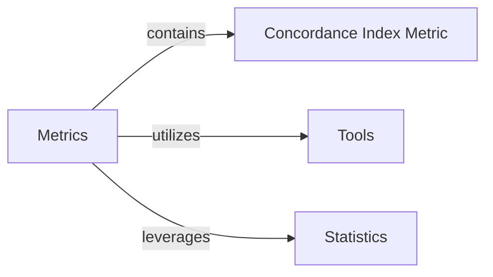

## Details

This analysis details the core components of the `torchsurv` library, focusing on the `Concordance Index Metric` for survival model evaluation and its interactions with the `Metrics`, `Tools`, and `Statistics` components.

### Concordance Index Metric [[Expand]](./Concordance_Index_Metric.md)
This component provides the implementation for calculating the Concordance Index (C-index), a key metric for evaluating the discriminative power of survival models. It assesses the agreement between predicted risk and observed survival outcomes, accounting for censoring.

**Related Classes/Methods**:

- <a href="https://github.com/Novartis/torchsurv/src/torchsurv/metrics/cindex.py#L1-L1" target="_blank" rel="noopener noreferrer">`torchsurv.metrics.cindex` (1:1)</a>

### Metrics [[Expand]](./Metrics.md)
This component serves as a collection of various evaluation metrics for survival analysis, including AUC, Brier Score, and the Concordance Index. It provides a standardized way to assess model performance.

**Related Classes/Methods**:

- <a href="https://github.com/Novartis/torchsurv/src/torchsurv/metrics/auc.py#L1-L1" target="_blank" rel="noopener noreferrer">`torchsurv.metrics.auc` (1:1)</a>
- <a href="https://github.com/Novartis/torchsurv/src/torchsurv/metrics/brier_score.py#L1-L1" target="_blank" rel="noopener noreferrer">`torchsurv.metrics.brier_score` (1:1)</a>
- <a href="https://github.com/Novartis/torchsurv/src/torchsurv/metrics/cindex.py#L1-L1" target="_blank" rel="noopener noreferrer">`torchsurv.metrics.cindex` (1:1)</a>

### Tools
This component provides utility functions, primarily for input validation, ensuring that data passed to other components (like metrics or loss functions) adheres to expected formats and constraints.

**Related Classes/Methods**:

- <a href="https://github.com/Novartis/torchsurv/src/torchsurv/tools/validate_inputs.py#L1-L1" target="_blank" rel="noopener noreferrer">`torchsurv.tools.validate_inputs` (1:1)</a>

### Statistics [[Expand]](./Statistics.md)
This component offers statistical utilities relevant to survival analysis, such as Kaplan-Meier estimation and Inverse Probability of Censoring Weighting (IPCW). These are often used for data preparation, analysis, or in conjunction with model evaluation.

**Related Classes/Methods**:

- <a href="https://github.com/Novartis/torchsurv/src/torchsurv/stats/ipcw.py#L1-L1" target="_blank" rel="noopener noreferrer">`torchsurv.stats.ipcw` (1:1)</a>
- <a href="https://github.com/Novartis/torchsurv/src/torchsurv/stats/kaplan_meier.py#L1-L1" target="_blank" rel="noopener noreferrer">`torchsurv.stats.kaplan_meier` (1:1)</a>

### [FAQ](https://github.com/CodeBoarding/GeneratedOnBoardings/tree/main?tab=readme-ov-file#faq)