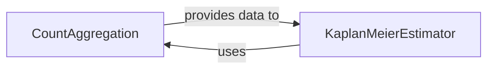

## Details

Analysis of the `CountAggregation` subsystem, identifying `CountAggregation` and `KaplanMeierEstimator` as central components. `CountAggregation` is an internal part of `KaplanMeierEstimator`, responsible for data preprocessing for Kaplan-Meier survival analysis.

### CountAggregation [[Expand]](./CountAggregation.md)
This component is responsible for processing validated survival data to derive the essential counts (unique time points, number of events, number of censored observations, and the number of individuals at risk) required for the Kaplan-Meier product-limit formula. It efficiently aggregates the data, serving as a crucial preprocessing step.

**Related Classes/Methods**:

- `KaplanMeierEstimator:_compute_counts` (0:0)

### KaplanMeierEstimator [[Expand]](./KaplanMeierEstimator.md)
This component implements the Kaplan-Meier product-limit estimator for survival analysis. It takes survival data (time and event status) and computes the survival function, including the necessary aggregation of counts and the application of the Kaplan-Meier formula.

**Related Classes/Methods**:

- `KaplanMeierEstimator` (0:0)

### [FAQ](https://github.com/CodeBoarding/GeneratedOnBoardings/tree/main?tab=readme-ov-file#faq)