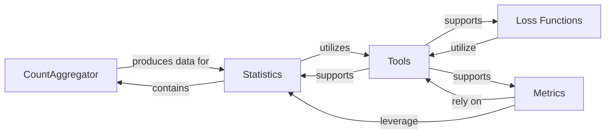

## Details

The `getClassHierarchy` tool did not return any explicit class hierarchy for the `torchsurv` package. This suggests that the library might be structured more around functions and modules rather than a deep object-oriented inheritance model, or that the classes present do not form a complex inheritance tree detectable by the tool at the package level.

### CountAggregator [[Expand]](./CountAggregator.md)
An internal component of the `KaplanMeierEstimator`, implemented as the `_compute_counts` method. Its responsibility is to process the raw survival data to derive the fundamental counts required for the Kaplan-Meier formula, including unique time points, the number of individuals at risk, events, and censored observations. This component is crucial for preparing the data for the Kaplan-Meier estimation.

**Related Classes/Methods**:

- `KaplanMeierEstimator:_compute_counts` (1:1)

### Loss Functions [[Expand]](./Loss_Functions.md)
This component provides various loss functions essential for training survival models. These functions quantify the discrepancy between predicted and actual survival outcomes, guiding the model's learning process.

**Related Classes/Methods**:

- <a href="https://github.com/Novartis/torchsurv/src/torchsurv/loss/cox.py#L1-L1" target="_blank" rel="noopener noreferrer">`torchsurv.loss.cox` (1:1)</a>
- <a href="https://github.com/Novartis/torchsurv/src/torchsurv/loss/momentum.py#L1-L1" target="_blank" rel="noopener noreferrer">`torchsurv.loss.momentum` (1:1)</a>
- <a href="https://github.com/Novartis/torchsurv/src/torchsurv/loss/weibull.py#L1-L1" target="_blank" rel="noopener noreferrer">`torchsurv.loss.weibull` (1:1)</a>

### Metrics [[Expand]](./Metrics.md)
This component offers a suite of evaluation metrics specifically tailored for survival analysis. These metrics are used to assess the performance and accuracy of survival models.

**Related Classes/Methods**:

- <a href="https://github.com/Novartis/torchsurv/src/torchsurv/metrics/auc.py#L1-L1" target="_blank" rel="noopener noreferrer">`torchsurv.metrics.auc` (1:1)</a>
- <a href="https://github.com/Novartis/torchsurv/src/torchsurv/metrics/brier_score.py#L1-L1" target="_blank" rel="noopener noreferrer">`torchsurv.metrics.brier_score` (1:1)</a>
- <a href="https://github.com/Novartis/torchsurv/src/torchsurv/metrics/cindex.py#L1-L1" target="_blank" rel="noopener noreferrer">`torchsurv.metrics.cindex` (1:1)</a>

### Statistics [[Expand]](./Statistics.md)
This component provides statistical utilities relevant to survival analysis, such as methods for Kaplan-Meier estimation and Inverse Probability of Censoring Weighting (IPCW). These are often used for data preparation, analysis, or in conjunction with model evaluation.

**Related Classes/Methods**:

- <a href="https://github.com/Novartis/torchsurv/src/torchsurv/stats/ipcw.py#L1-L1" target="_blank" rel="noopener noreferrer">`torchsurv.stats.ipcw` (1:1)</a>
- <a href="https://github.com/Novartis/torchsurv/src/torchsurv/stats/kaplan_meier.py#L1-L1" target="_blank" rel="noopener noreferrer">`torchsurv.stats.kaplan_meier` (1:1)</a>

### Tools
This component contains utility functions that support other parts of the `torchsurv` library. Specifically, it includes input validation routines to ensure that data passed to other components meets the expected format and constraints.

**Related Classes/Methods**:

- <a href="https://github.com/Novartis/torchsurv/src/torchsurv/tools/validate_inputs.py#L1-L1" target="_blank" rel="noopener noreferrer">`torchsurv.tools.validate_inputs` (1:1)</a>

### [FAQ](https://github.com/CodeBoarding/GeneratedOnBoardings/tree/main?tab=readme-ov-file#faq)