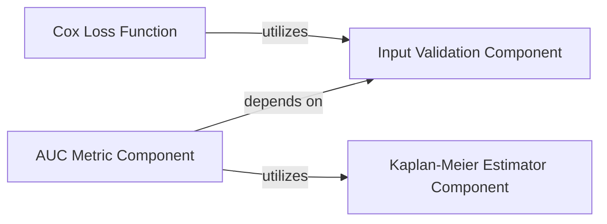

## Details

This document describes key components of the `torchsurv` library, including the `Cox Loss Function`, `AUC Metric Component`, `Kaplan-Meier Estimator Component`, and `Input Validation Component`, highlighting their functionalities and interdependencies within the survival analysis framework.

### Cox Loss Function [[Expand]](./Cox_Loss_Function.md)
This component calculates the negative partial log-likelihood, the primary objective function for Cox proportional hazards models. It supports Cox, Efron, and Breslow approximation methods for handling tied event times, ensuring robust and accurate loss computation.

**Related Classes/Methods**:

- `neg_partial_log_likelihood` (0:0)
- `_partial_likelihood_cox` (0:0)
- `_partial_likelihood_efron` (0:0)
- `_partial_likelihood_breslow` (0:0)
- `_check_inputs` (0:0)

### AUC Metric Component [[Expand]](./AUC_Metric_Component.md)
This component is responsible for the comprehensive calculation, validation, and statistical analysis of the Area Under the Curve (AUC) for survival data. It handles input validation, updates AUC estimates over time, calculates integrals, determines confidence intervals, computes p-values, and facilitates AUC comparisons.

**Related Classes/Methods**:

- <a href="https://github.com/Novartis/torchsurv/src/torchsurv/metrics/auc.py#L12-L1283" target="_blank" rel="noopener noreferrer">`Auc` (12:1283)</a>

### Kaplan-Meier Estimator Component
This component provides functionalities for estimating survival probabilities using the Kaplan-Meier method. It is crucial for calculating baseline survival curves, which are often required as inputs or for intermediate calculations in survival analysis metrics like AUC (e.g., for IPCW).

**Related Classes/Methods**:

- `KaplanMeierEstimator` (0:0)

### Input Validation Component
This component provides utility functions to validate the format and content of input data, specifically for survival data, evaluation times, and estimates. It ensures that the data conforms to expected structures and types before being processed by other components, preventing errors and ensuring the reliability of calculations.

**Related Classes/Methods**:

- `validate_survival_data` (0:0)
- `validate_evaluation_time` (0:0)
- `validate_estimate` (0:0)

### [FAQ](https://github.com/CodeBoarding/GeneratedOnBoardings/tree/main?tab=readme-ov-file#faq)