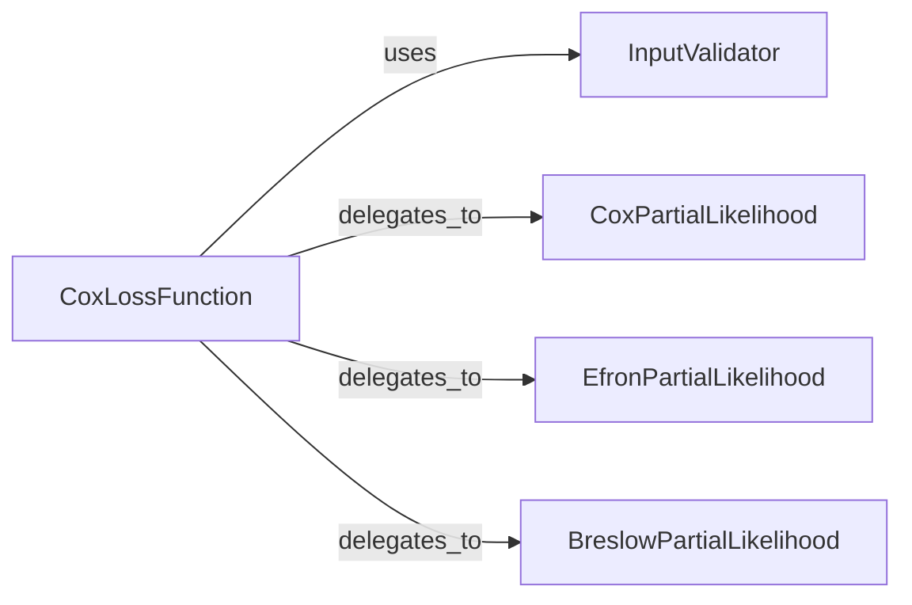

## Details

This subsystem is dedicated to computing the negative log-partial likelihood, which is the core objective function for training Cox proportional hazards models. It is specifically designed for survival data, focusing on the relative ordering of event times and effectively handling censored observations without making assumptions about the baseline hazard function.

### CoxLossFunction
This is the primary entry point and orchestrator of the Cox loss calculation. Implemented by `torchsurv.loss.cox.neg_partial_log_likelihood`, it handles initial input processing, including validation and data sorting, and then dispatches the core partial likelihood calculation to the appropriate tie-handling method based on the specified `ties_method`. It is fundamental as it serves as the public API and coordinates the entire loss computation flow.

**Related Classes/Methods**:

- <a href="https://github.com/Novartis/torchsurv/src/torchsurv/loss/cox.py#L9-L167" target="_blank" rel="noopener noreferrer">`torchsurv.loss.cox.neg_partial_log_likelihood` (9:167)</a>

### InputValidator [[Expand]](./InputValidator.md)
This component, implemented by `torchsurv.loss.cox._check_inputs`, is solely responsible for validating the input tensors (`log_hz`, `event`, and `time`). It ensures that these inputs meet the necessary criteria (e.g., correct dimensions, data types, and non-empty event counts) for accurate and stable loss calculation. It is fundamental because robust input validation prevents common errors and ensures the stability and correctness of the loss computation.

**Related Classes/Methods**:

- <a href="https://github.com/Novartis/torchsurv/src/torchsurv/loss/cox.py#L279-L305" target="_blank" rel="noopener noreferrer">`torchsurv.loss.cox._check_inputs` (279:305)</a>

### CoxPartialLikelihood
This component, implemented by `torchsurv.loss.cox._partial_likelihood_cox`, calculates the partial likelihood specifically when no ties are present in the event times. It represents the most straightforward calculation of the Cox partial likelihood. It is fundamental as it serves as the base case for the partial likelihood calculation, forming the foundation upon which tie-handling methods are built.

**Related Classes/Methods**:

- <a href="https://github.com/Novartis/torchsurv/src/torchsurv/loss/cox.py#L170-L198" target="_blank" rel="noopener noreferrer">`torchsurv.loss.cox._partial_likelihood_cox` (170:198)</a>

### EfronPartialLikelihood
This component, implemented by `torchsurv.loss.cox._partial_likelihood_efron`, calculates the partial likelihood using Efron's approximation for handling tied event times. Efron's method is a widely accepted and generally more accurate approximation for ties compared to Breslow's. It is fundamental because it provides a robust and commonly used method to accurately handle tied events, which are frequent in real-world survival data.

**Related Classes/Methods**:

- <a href="https://github.com/Novartis/torchsurv/src/torchsurv/loss/cox.py#L201-L246" target="_blank" rel="noopener noreferrer">`torchsurv.loss.cox._partial_likelihood_efron` (201:246)</a>

### BreslowPartialLikelihood
This component, implemented by `torchsurv.loss.cox._partial_likelihood_breslow`, calculates the partial likelihood using Breslow's approximation for handling tied event times. While simpler than Efron's, it offers an alternative approach to tie handling. It is fundamental as it provides another valid, often computationally less intensive, method for addressing tied events, offering flexibility in implementation choices.

**Related Classes/Methods**:

- <a href="https://github.com/Novartis/torchsurv/src/torchsurv/loss/cox.py#L249-L276" target="_blank" rel="noopener noreferrer">`torchsurv.loss.cox._partial_likelihood_breslow` (249:276)</a>

### [FAQ](https://github.com/CodeBoarding/GeneratedOnBoardings/tree/main?tab=readme-ov-file#faq)