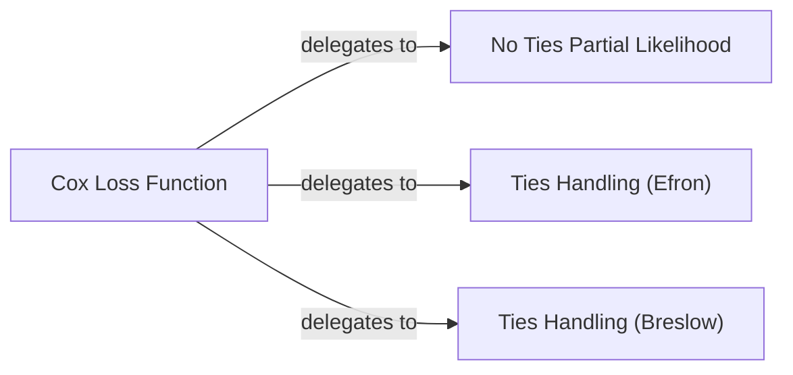

## Details

The `Cox Loss Module` is a critical component within the `torchsurv` project, specifically designed to compute the Cox Proportional Hazards loss function. This module is fundamental for training survival models by quantifying the discrepancy between predicted and actual survival outcomes. Its core functionality is encapsulated in the `neg_partial_log_likelihood` function, which intelligently handles various scenarios, including different methods for tied event times.

### Cox Loss Function [[Expand]](./Cox_Loss_Function.md)
This is the primary interface for calculating the negative partial log-likelihood for the Cox Proportional Hazards model. It orchestrates the selection of the appropriate partial likelihood calculation method based on whether ties are present in the event times and the specified tie-handling approach (Efron or Breslow). It also manages loss reduction (mean or sum).

**Related Classes/Methods**:

- <a href="https://github.com/Novartis/torchsurv/src/torchsurv/loss/cox.py#L9-L167" target="_blank" rel="noopener noreferrer">`torchsurv.loss.cox.neg_partial_log_likelihood` (9:167)</a>

### No Ties Partial Likelihood
This internal helper function calculates the partial log-likelihood specifically when there are no tied event times. It implements the standard Cox partial likelihood formula.

**Related Classes/Methods**:

- <a href="https://github.com/Novartis/torchsurv/src/torchsurv/loss/cox.py#L170-L198" target="_blank" rel="noopener noreferrer">`torchsurv.loss.cox._partial_likelihood_cox` (170:198)</a>

### Ties Handling (Efron)
This internal helper function computes the partial log-likelihood using Efron's method to approximate the likelihood when ties are present in the event times. Efron's method is generally considered more accurate than Breslow's for handling ties.

**Related Classes/Methods**:

- <a href="https://github.com/Novartis/torchsurv/src/torchsurv/loss/cox.py#L201-L246" target="_blank" rel="noopener noreferrer">`torchsurv.loss.cox._partial_likelihood_efron` (201:246)</a>

### Ties Handling (Breslow)
This internal helper function calculates the partial log-likelihood using Breslow's method for handling tied event times. Breslow's method is a simpler approximation compared to Efron's.

**Related Classes/Methods**:

- <a href="https://github.com/Novartis/torchsurv/src/torchsurv/loss/cox.py#L249-L276" target="_blank" rel="noopener noreferrer">`torchsurv.loss.cox._partial_likelihood_breslow` (249:276)</a>

### [FAQ](https://github.com/CodeBoarding/GeneratedOnBoardings/tree/main?tab=readme-ov-file#faq)