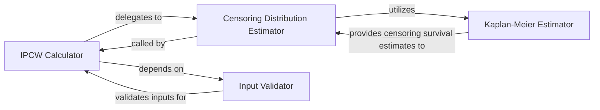

## Details

This component is fundamental because it addresses a significant challenge in survival analysis: censored data. By providing Inverse Probability of Censoring Weights (IPCW), it enables the Auc Metric Component to produce statistically sound and unbiased results, which is critical for accurate model evaluation in real-world scenarios.

### IPCW Calculator [[Expand]](./IPCW_Calculator.md)
This is the core function responsible for orchestrating the calculation of Inverse Probability of Censoring Weights (IPCW). It takes survival data (event times, event indicators) and computes weights that account for censoring, which are essential for unbiased survival analysis. It acts as the primary entry point for IPCW calculation.

**Related Classes/Methods**:

- `get_ipcw` (1:1)

### Censoring Distribution Estimator
A crucial helper function within the IPCW module that calculates the inverse of the censoring distribution. This is an intermediate step for computing IPCW, as the IPCW formula is defined as the inverse of the censoring distribution. It leverages the Kaplan-Meier Estimator to achieve this.

**Related Classes/Methods**:

- `_inverse_censoring_dist` (1:1)

### Input Validator
A utility function that ensures the input survival data (event times and event indicators) are in the correct format and meet necessary conditions (e.g., non-negative times, binary event indicators). It raises errors for invalid inputs, ensuring data quality and preventing downstream calculation errors.

**Related Classes/Methods**:

- `validate_survival_data` (1:1)

### Kaplan-Meier Estimator
A class that implements the Kaplan-Meier method to estimate the survival function. In the context of IPCW, it is specifically used by the `Censoring Distribution Estimator` to estimate the *censoring* distribution, which is a prerequisite for calculating IPCW. It provides a robust non-parametric estimate of survival probabilities.

**Related Classes/Methods**:

- `KaplanMeierEstimator` (1:1)

### [FAQ](https://github.com/CodeBoarding/GeneratedOnBoardings/tree/main?tab=readme-ov-file#faq)