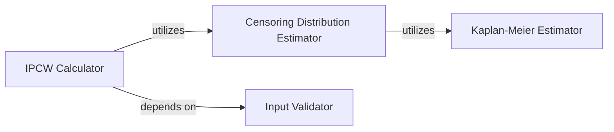

## Details

This subsystem is dedicated to the robust calculation of Inverse Probability of Censoring Weights (IPCW), a critical step for accurately assessing concordance in survival analysis, especially with censored data. The design emphasizes modularity, data validation, and adherence to established statistical methodologies.

### IPCW Calculator [[Expand]](./IPCW_Calculator.md)
This is the central orchestrator of the subsystem. Its primary responsibility is to compute the Inverse Probability of Censoring Weights (IPCW) based on provided survival data (event times, event indicators). It integrates the outputs from other components to produce the final weights, which are essential for adjusting C-index calculations as per Uno et al. (2011).

**Related Classes/Methods**:

- `IPCW Calculator` (1:1)

### Censoring Distribution Estimator
This component is a crucial internal helper responsible for calculating the inverse of the censoring distribution. It quantifies the probability of an individual remaining uncensored up to a specific time point. This estimation is a fundamental intermediate step, directly feeding into the `IPCW Calculator`.

**Related Classes/Methods**:

- `Censoring Distribution Estimator` (1:1)

### Input Validator
This utility component ensures the integrity and correctness of all incoming survival data. It rigorously validates event times and event indicators, checking for appropriate formats, non-negative values, and binary event indicators. By raising errors for invalid inputs, it acts as a gatekeeper, guaranteeing data quality before any statistical processing begins.

**Related Classes/Methods**:

- `Input Validator` (1:1)

### Kaplan-Meier Estimator
This component implements the non-parametric Kaplan-Meier method, a standard statistical tool for estimating survival functions from censored data. In this subsystem, it is specifically utilized by the `Censoring Distribution Estimator` to derive the probabilities of being uncensored over time, which are then inverted.

**Related Classes/Methods**:

- `Kaplan-Meier Estimator` (1:1)

### [FAQ](https://github.com/CodeBoarding/GeneratedOnBoardings/tree/main?tab=readme-ov-file#faq)