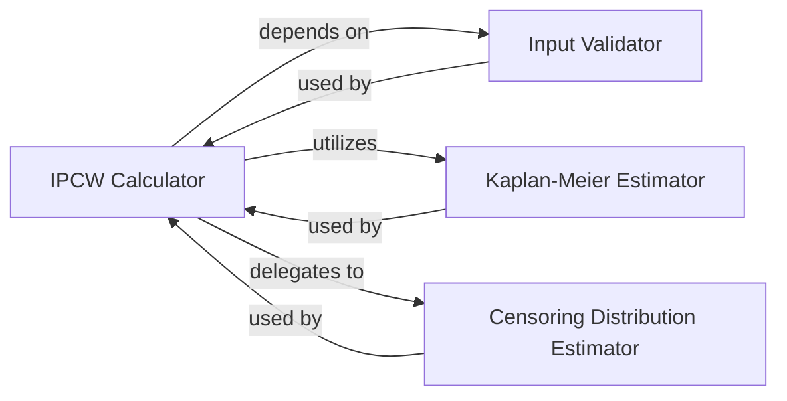

## Details

The `getClassHierarchy` tool did not return any class hierarchy for `torchsurv.stats`. This suggests that the components within `torchsurv.stats` might be primarily functions rather than a complex class-based hierarchy. Given the previous analysis, the core components are indeed functions and a single class (`KaplanMeierEstimator`).

### IPCW Calculator [[Expand]](./IPCW_Calculator.md)
This is the central orchestrator. It takes raw survival data, validates it, estimates the censoring distribution using the Kaplan-Meier method, and then computes the final IPCW values. It's fundamental because it ties all the other pieces together to produce the desired output.

**Related Classes/Methods**:

- <a href="https://github.com/Novartis/torchsurv/src/torchsurv/stats/ipcw.py#L11-L76" target="_blank" rel="noopener noreferrer">`torchsurv.stats.ipcw:get_ipcw` (11:76)</a>

### Censoring Distribution Estimator
This component is a specialized function that calculates the inverse of the censoring distribution. It's a critical mathematical step within the overall IPCW computation, providing the probabilities needed to weight observations based on their censoring status. It's fundamental because it performs the core mathematical operation of inverting the probabilities.

**Related Classes/Methods**:

- <a href="https://github.com/Novartis/torchsurv/src/torchsurv/stats/ipcw.py#L79-L103" target="_blank" rel="noopener noreferrer">`torchsurv.stats.ipcw:_inverse_censoring_dist` (79:103)</a>

### Input Validator
This utility component ensures the integrity and correctness of the input survival data. It performs crucial checks on event times and event indicators, preventing downstream computational issues. It's fundamental because robust input validation is essential for the reliability and correctness of any data processing system.

**Related Classes/Methods**:

- <a href="https://github.com/Novartis/torchsurv/src/torchsurv/tools/validate_inputs.py#L3-L37" target="_blank" rel="noopener noreferrer">`torchsurv.tools.validate_inputs:validate_survival_data` (3:37)</a>

### Kaplan-Meier Estimator
This component implements the Kaplan-Meier method, used here specifically to estimate the *censoring* distribution. This estimation is crucial for determining the probability of an individual being uncensored, which is a key input for the IPCW calculation. It's fundamental because it provides the necessary statistical model for estimating censoring probabilities.

**Related Classes/Methods**:

- <a href="https://github.com/Novartis/torchsurv/src/torchsurv/stats/kaplan_meier.py#L9-L252" target="_blank" rel="noopener noreferrer">`torchsurv.stats.kaplan_meier:KaplanMeierEstimator` (9:252)</a>

### [FAQ](https://github.com/CodeBoarding/GeneratedOnBoardings/tree/main?tab=readme-ov-file#faq)