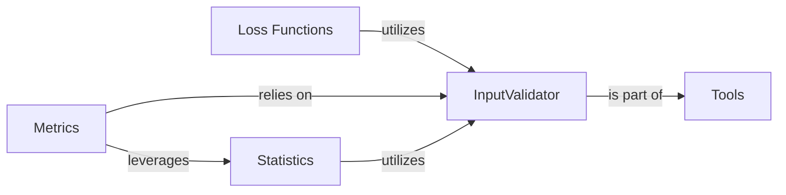

## Details

These components are fundamental to `torchsurv` because they collectively cover the essential aspects of building, training, and evaluating survival models: InputValidator: Data integrity is paramount in any data-driven system. This component ensures that all input survival data is correctly formatted and valid, preventing errors and ensuring the reliability and robustness of all subsequent computations across the library. Loss Functions: These are the core of any machine learning model's training process. They provide the objective function that the model optimizes, guiding the learning process to minimize the discrepancy between predicted and actual survival outcomes. Without well-defined loss functions, model training would be impossible. Metrics: Evaluation is crucial for understanding a model's performance and for comparing different models. Survival-specific metrics provide specialized insights into how well the model predicts survival probabilities and ranks individuals, which cannot be adequately captured by standard classification or regression metrics. Statistics: Survival analysis has unique statistical considerations, particularly due to censored observations. Components like Kaplan-Meier estimation and Inverse Probability of Censoring Weighting (IPCW) are fundamental for understanding the underlying data distribution, correctly handling censored data, and performing unbiased evaluations. Tools: This component, by housing general utilities like `InputValidator`, provides foundational support and promotes reusability across the library. It centralizes common helper functions, preventing code duplication and ensuring consistent behavior for frequently performed tasks, thereby enhancing the overall maintainability and efficiency of the `torchsurv` library.

### InputValidator [[Expand]](./InputValidator.md)
This component is solely dedicated to ensuring the integrity and correct format of the input survival data, specifically event times and event indicators. It performs crucial checks to prevent errors and ensure the reliability of subsequent computations across the `torchsurv` library.

**Related Classes/Methods**:

- <a href="https://github.com/Novartis/torchsurv/src/torchsurv/tools/validate_inputs.py#L0-L0" target="_blank" rel="noopener noreferrer">`torchsurv.tools.validate_inputs` (0:0)</a>

### Loss Functions [[Expand]](./Loss_Functions.md)
This component provides various loss functions essential for training survival models. These functions quantify the discrepancy between predicted and actual survival outcomes, guiding the model's learning process.

**Related Classes/Methods**:

- <a href="https://github.com/Novartis/torchsurv/src/torchsurv/loss/cox.py#L0-L0" target="_blank" rel="noopener noreferrer">`torchsurv.loss.cox` (0:0)</a>
- <a href="https://github.com/Novartis/torchsurv/src/torchsurv/loss/momentum.py#L0-L0" target="_blank" rel="noopener noreferrer">`torchsurv.loss.momentum` (0:0)</a>
- <a href="https://github.com/Novartis/torchsurv/src/torchsurv/loss/weibull.py#L0-L0" target="_blank" rel="noopener noreferrer">`torchsurv.loss.weibull` (0:0)</a>

### Metrics [[Expand]](./Metrics.md)
This component offers a suite of evaluation metrics specifically tailored for survival analysis. These metrics are used to assess the performance and accuracy of survival models.

**Related Classes/Methods**:

- <a href="https://github.com/Novartis/torchsurv/src/torchsurv/metrics/auc.py#L0-L0" target="_blank" rel="noopener noreferrer">`torchsurv.metrics.auc` (0:0)</a>
- <a href="https://github.com/Novartis/torchsurv/src/torchsurv/metrics/brier_score.py#L0-L0" target="_blank" rel="noopener noreferrer">`torchsurv.metrics.brier_score` (0:0)</a>
- <a href="https://github.com/Novartis/torchsurv/src/torchsurv/metrics/cindex.py#L0-L0" target="_blank" rel="noopener noreferrer">`torchsurv.metrics.cindex` (0:0)</a>

### Statistics [[Expand]](./Statistics.md)
This component provides statistical utilities relevant to survival analysis, such as methods for Kaplan-Meier estimation and Inverse Probability of Censoring Weighting (IPCW). These are often used for data preparation, analysis, or in conjunction with model evaluation.

**Related Classes/Methods**:

- <a href="https://github.com/Novartis/torchsurv/src/torchsurv/stats/ipcw.py#L0-L0" target="_blank" rel="noopener noreferrer">`torchsurv.stats.ipcw` (0:0)</a>
- <a href="https://github.com/Novartis/torchsurv/src/torchsurv/stats/kaplan_meier.py#L0-L0" target="_blank" rel="noopener noreferrer">`torchsurv.stats.kaplan_meier` (0:0)</a>

### Tools
This component contains general utility functions that support other parts of the `torchsurv` library. It serves as a foundational module for common helper functions, including the `InputValidator` functionality.

**Related Classes/Methods**:

- <a href="https://github.com/Novartis/torchsurv/src/torchsurv/tools/validate_inputs.py#L0-L0" target="_blank" rel="noopener noreferrer">`torchsurv.tools.validate_inputs` (0:0)</a>

### [FAQ](https://github.com/CodeBoarding/GeneratedOnBoardings/tree/main?tab=readme-ov-file#faq)