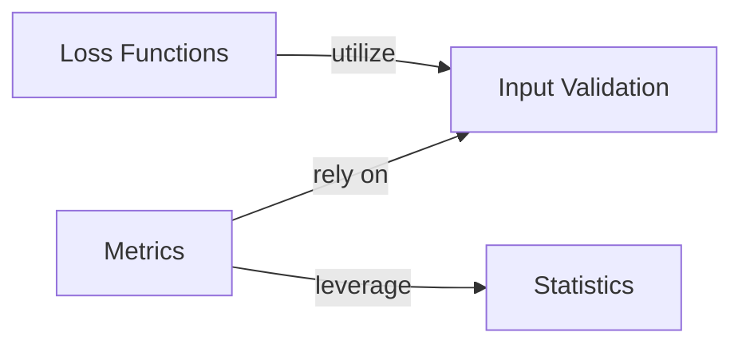

## Details

This document provides a detailed overview of the `Input Validation` component within the `torchsurv` project, outlining its structure, purpose, and interactions with other key components. It also describes other core components like `Loss Functions`, `Metrics`, and `Statistics`.

### Input Validation [[Expand]](./Input_Validation.md)
This utility component provides a set of functions to validate various inputs used across the survival analysis metrics and loss functions. Its primary purpose is to ensure that all input data (e.g., survival times, event indicators, model estimates, evaluation times) conforms to expected formats, data types, and constraints. This prevents common errors, ensures the reliability of downstream calculations, and enhances the robustness of the entire `torchsurv` library.

**Related Classes/Methods**:

- <a href="https://github.com/Novartis/torchsurv/src/torchsurv/tools/validate_inputs.py#L1-L1" target="_blank" rel="noopener noreferrer">`torchsurv.tools.validate_inputs` (1:1)</a>

### Loss Functions [[Expand]](./Loss_Functions.md)
This component provides various loss functions essential for training survival models. These functions quantify the discrepancy between predicted and actual survival outcomes, guiding the model's learning process.

**Related Classes/Methods**:

- <a href="https://github.com/Novartis/torchsurv/src/torchsurv/loss/cox.py#L1-L1" target="_blank" rel="noopener noreferrer">`torchsurv.loss.cox` (1:1)</a>
- <a href="https://github.com/Novartis/torchsurv/src/torchsurv/loss/momentum.py#L1-L1" target="_blank" rel="noopener noreferrer">`torchsurv.loss.momentum` (1:1)</a>
- <a href="https://github.com/Novartis/torchsurv/src/torchsurv/loss/weibull.py#L1-L1" target="_blank" rel="noopener noreferrer">`torchsurv.loss.weibull` (1:1)</a>

### Metrics [[Expand]](./Metrics.md)
This component offers a suite of evaluation metrics specifically tailored for survival analysis. These metrics are used to assess the performance and accuracy of survival models.

**Related Classes/Methods**:

- <a href="https://github.com/Novartis/torchsurv/src/torchsurv/metrics/auc.py#L1-L1" target="_blank" rel="noopener noreferrer">`torchsurv.metrics.auc` (1:1)</a>
- <a href="https://github.com/Novartis/torchsurv/src/torchsurv/metrics/brier_score.py#L1-L1" target="_blank" rel="noopener noreferrer">`torchsurv.metrics.brier_score` (1:1)</a>
- <a href="https://github.com/Novartis/torchsurv/src/torchsurv/metrics/cindex.py#L1-L1" target="_blank" rel="noopener noreferrer">`torchsurv.metrics.cindex` (1:1)</a>

### Statistics [[Expand]](./Statistics.md)
This component provides statistical utilities relevant to survival analysis, such as methods for Kaplan-Meier estimation and Inverse Probability of Censoring Weighting (IPCW). These are often used for data preparation, analysis, or in conjunction with model evaluation.

**Related Classes/Methods**:

- <a href="https://github.com/Novartis/torchsurv/src/torchsurv/stats/ipcw.py#L1-L1" target="_blank" rel="noopener noreferrer">`torchsurv.stats.ipcw` (1:1)</a>
- <a href="https://github.com/Novartis/torchsurv/src/torchsurv/stats/kaplan_meier.py#L1-L1" target="_blank" rel="noopener noreferrer">`torchsurv.stats.kaplan_meier` (1:1)</a>

### [FAQ](https://github.com/CodeBoarding/GeneratedOnBoardings/tree/main?tab=readme-ov-file#faq)