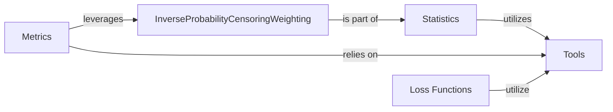

## Details

This component is a specialized part of the `torchsurv` library, designed to address a critical challenge in survival analysis: censored data. Its primary purpose is to calculate Inverse Probability Censoring Weights (IPCW), a statistical technique used to adjust for bias introduced by censored observations. This adjustment is particularly vital for obtaining unbiased estimates of performance metrics like the Area Under the Curve (AUC) in survival models.

### InverseProbabilityCensoringWeighting [[Expand]](./InverseProbabilityCensoringWeighting.md)
The core component responsible for computing Inverse Probability Censoring Weights (IPCW). It quantifies the probability of an observation remaining uncensored, allowing for a weighted analysis that mitigates censoring bias.

**Related Classes/Methods**:

- <a href="https://github.com/Novartis/torchsurv/src/torchsurv/stats/ipcw.py#L1-L1" target="_blank" rel="noopener noreferrer">`torchsurv.stats.ipcw.InverseProbabilityCensoringWeighting` (1:1)</a>

### Statistics [[Expand]](./Statistics.md)
A foundational component providing a collection of statistical utilities essential for survival analysis. This includes methods for Kaplan-Meier estimation and, crucially, the InverseProbabilityCensoringWeighting functionality.

**Related Classes/Methods**:

- <a href="https://github.com/Novartis/torchsurv/src/torchsurv/stats/ipcw.py#L1-L1" target="_blank" rel="noopener noreferrer">`torchsurv.stats.ipcw` (1:1)</a>
- <a href="https://github.com/Novartis/torchsurv/src/torchsurv/stats/kaplan_meier.py#L1-L1" target="_blank" rel="noopener noreferrer">`torchsurv.stats.kaplan_meier` (1:1)</a>

### Metrics [[Expand]](./Metrics.md)
This component offers a suite of evaluation metrics specifically designed for assessing the performance of survival models. It includes metrics like AUC, Brier Score, and C-index.

**Related Classes/Methods**:

- <a href="https://github.com/Novartis/torchsurv/src/torchsurv/metrics/auc.py#L1-L1" target="_blank" rel="noopener noreferrer">`torchsurv.metrics.auc` (1:1)</a>
- <a href="https://github.com/Novartis/torchsurv/src/torchsurv/metrics/brier_score.py#L1-L1" target="_blank" rel="noopener noreferrer">`torchsurv.metrics.brier_score` (1:1)</a>
- <a href="https://github.com/Novartis/torchsurv/src/torchsurv/metrics/cindex.py#L1-L1" target="_blank" rel="noopener noreferrer">`torchsurv.metrics.cindex` (1:1)</a>

### Tools
A utility component focused on input validation and other foundational helper functions. Its primary role is to ensure data quality and prevent errors across various parts of the library.

**Related Classes/Methods**:

- <a href="https://github.com/Novartis/torchsurv/src/torchsurv/tools/validate_inputs.py#L1-L1" target="_blank" rel="noopener noreferrer">`torchsurv.tools.validate_inputs` (1:1)</a>

### Loss Functions [[Expand]](./Loss_Functions.md)
This component provides the mathematical functions used to quantify prediction errors during the training of survival models. Examples include Cox, Momentum, and Weibull loss functions.

**Related Classes/Methods**:

- <a href="https://github.com/Novartis/torchsurv/src/torchsurv/loss/cox.py#L1-L1" target="_blank" rel="noopener noreferrer">`torchsurv.loss.cox` (1:1)</a>
- <a href="https://github.com/Novartis/torchsurv/src/torchsurv/loss/momentum.py#L1-L1" target="_blank" rel="noopener noreferrer">`torchsurv.loss.momentum` (1:1)</a>
- <a href="https://github.com/Novartis/torchsurv/src/torchsurv/loss/weibull.py#L1-L1" target="_blank" rel="noopener noreferrer">`torchsurv.loss.weibull` (1:1)</a>

### [FAQ](https://github.com/CodeBoarding/GeneratedOnBoardings/tree/main?tab=readme-ov-file#faq)