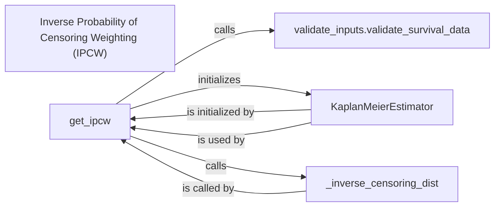

## Details

Given the previous analysis and the limited information from `getClassHierarchy`, I will proceed with the following components, focusing on their functional roles and interactions as identified in the initial analysis. The components chosen are fundamental because they directly contribute to the core functionality of IPCW calculation or are essential for data preparation and statistical modeling within this context.

### Inverse Probability of Censoring Weighting (IPCW) [[Expand]](./Inverse_Probability_of_Censoring_Weighting_IPCW_.md)
This is the overarching component responsible for providing the Inverse Probability of Censoring Weighting functionality. It orchestrates the use of other sub-components to achieve its goal of adjusting for censoring in survival analysis.

**Related Classes/Methods**:

- <a href="https://github.com/Novartis/torchsurv/src/torchsurv/stats/ipcw.py#L1-L1" target="_blank" rel="noopener noreferrer">`torchsurv.stats.ipcw` (1:1)</a>

### get_ipcw [[Expand]](./get_ipcw.md)
This is the primary public function within the IPCW component. It calculates the inverse probability censoring weights. It acts as the entry point for users to compute IPCW, coordinating the validation of inputs, fitting the censoring model, and calculating the inverse censoring distribution.

**Related Classes/Methods**:

- <a href="https://github.com/Novartis/torchsurv/src/torchsurv/stats/ipcw.py#L11-L76" target="_blank" rel="noopener noreferrer">`torchsurv.stats.ipcw:get_ipcw` (11:76)</a>

### _inverse_censoring_dist
This is an internal helper function, crucial for the `get_ipcw` function. Its sole responsibility is to compute the inverse of the censoring distribution, which is a core mathematical step in deriving the IPCW. It encapsulates the specific logic for this calculation.

**Related Classes/Methods**:

- <a href="https://github.com/Novartis/torchsurv/src/torchsurv/stats/ipcw.py#L79-L103" target="_blank" rel="noopener noreferrer">`torchsurv.stats.ipcw:_inverse_censoring_dist` (79:103)</a>

### KaplanMeierEstimator [[Expand]](./KaplanMeierEstimator.md)
This component, residing in the `kaplan_meier` module, is a fundamental external dependency. It's responsible for fitting the Kaplan-Meier censoring estimator, which is essential for modeling the censoring distribution. The IPCW calculation relies heavily on an accurate estimation of this distribution.

**Related Classes/Methods**:

- <a href="https://github.com/Novartis/torchsurv/src/torchsurv/stats/kaplan_meier.py#L9-L252" target="_blank" rel="noopener noreferrer">`torchsurv.stats.kaplan_meier.KaplanMeierEstimator` (9:252)</a>

### validate_inputs.validate_survival_data
This component is responsible for ensuring the integrity and correctness of the input survival data (`event` and `time` tensors). It acts as a gatekeeper, preventing erroneous calculations by validating the data format and types before they are used in the IPCW computation.

**Related Classes/Methods**:

- `torchsurv.utils.validate_inputs.validate_survival_data` (1:1)

### [FAQ](https://github.com/CodeBoarding/GeneratedOnBoardings/tree/main?tab=readme-ov-file#faq)