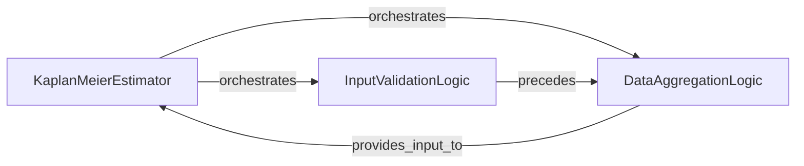

## Details

This subsystem focuses on providing robust Kaplan-Meier survival estimation, primarily utilized by components like IPCWCalculator to estimate censoring distributions. The analysis reveals that the core functionalities are encapsulated within a single primary class, KaplanMeierEstimator, with distinct internal logical components handling specific responsibilities.

### KaplanMeierEstimator [[Expand]](./KaplanMeierEstimator.md)
This is the central and primary component of the subsystem. It orchestrates the entire Kaplan-Meier survival estimation process, from input data handling to the final calculation of survival probabilities. It serves as the main interface for users to perform Kaplan-Meier analysis.

**Related Classes/Methods**:

- `KaplanMeierEstimator` (0:0)

### InputValidationLogic
An internal logical component within the KaplanMeierEstimator. Its sole responsibility is to validate the input survival data, specifically event times and event indicators. This ensures that the data is in the correct format and meets necessary conditions, safeguarding against errors and ensuring the reliability of subsequent computations.

**Related Classes/Methods**:

- `KaplanMeierEstimator` (0:0)

### DataAggregationLogic
Another internal logical component residing within the KaplanMeierEstimator. This component is responsible for aggregating the validated survival data. It computes the crucial counts of individuals at risk and the number of events at each unique time point, which are foundational for applying the Kaplan-Meier formula.

**Related Classes/Methods**:

- `KaplanMeierEstimator:_compute_counts` (0:0)

### [FAQ](https://github.com/CodeBoarding/GeneratedOnBoardings/tree/main?tab=readme-ov-file#faq)