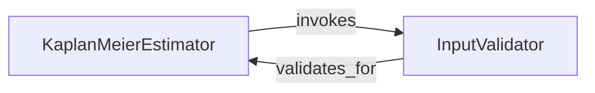

## Details

The Kaplan-Meier Estimator Component is a crucial part of the torchsurv library, specifically designed to estimate the censoring distribution within the context of Inverse Probability of Censoring Weighting (IPCW).

### KaplanMeierEstimator [[Expand]](./KaplanMeierEstimator.md)
This is the core component responsible for orchestrating the entire Kaplan-Meier survival estimation process. It takes survival data (event times and event indicators) as input, and critically, it invokes the InputValidator to ensure data correctness. Following validation, it computes the necessary counts of individuals at risk and events (via its internal _compute_counts method), and ultimately calculates the survival probabilities and their standard errors using the Kaplan-Meier product-limit formula.

**Related Classes/Methods**:

- `KaplanMeierEstimator` (0:0)

### InputValidator [[Expand]](./InputValidator.md)
This component, represented by the validate_survival_data function, is dedicated to ensuring the validity and correct format of the input survival data (event times and event indicators) before it is processed by the KaplanMeierEstimator. It acts as a critical safeguard, preventing errors in subsequent statistical computations by verifying data types, shapes, and value ranges.

**Related Classes/Methods**:

- `validate_survival_data` (0:0)

### [FAQ](https://github.com/CodeBoarding/GeneratedOnBoardings/tree/main?tab=readme-ov-file#faq)