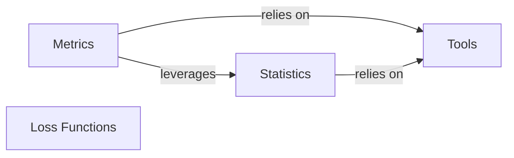

## Details

These components are fundamental to `torchsurv` because they collectively form the backbone for building, training, and evaluating survival models. In summary, `Metrics` provides the means to evaluate, `Loss Functions` enable training, `Statistics` offers the necessary statistical methods for handling survival data complexities, and `Tools` ensures the integrity of data flow across all components. This interconnectedness makes them all fundamental to a functional survival analysis library.

### Metrics [[Expand]](./Metrics.md)
This component provides a suite of evaluation metrics specifically designed for survival analysis. These metrics are used to assess the performance, accuracy, and discriminative power of survival models, offering quantitative insights into how well a model predicts survival outcomes. They are fundamental for model selection, hyperparameter tuning, and understanding the real-world applicability of survival models.

**Related Classes/Methods**:

- <a href="https://github.com/Novartis/torchsurv/src/torchsurv/metrics/auc.py#L12-L1283" target="_blank" rel="noopener noreferrer">`Auc` (12:1283)</a>
- <a href="https://github.com/Novartis/torchsurv/src/torchsurv/metrics/brier_score.py#L10-L903" target="_blank" rel="noopener noreferrer">`BrierScore` (10:903)</a>
- `ConcordanceIndex` (1:1)

### Loss Functions [[Expand]](./Loss_Functions.md)
This component provides various loss functions essential for training survival models. These functions quantify the discrepancy between predicted and actual survival outcomes, guiding the model's learning process.

**Related Classes/Methods**: _None_

### Statistics [[Expand]](./Statistics.md)
This component provides statistical utilities relevant to survival analysis, such as methods for Kaplan-Meier estimation and Inverse Probability of Censoring Weighting (IPCW). These are often used for data preparation, analysis, or in conjunction with model evaluation.

**Related Classes/Methods**:

- `KaplanMeierEstimator` (1:1)
- `get_ipcw` (1:1)

### Tools
This component contains utility functions that support other parts of the `torchsurv` library. Specifically, it includes input validation routines to ensure that data passed to other components meets the expected format and constraints.

**Related Classes/Methods**:

- `validate_survival_data` (1:1)
- `validate_evaluation_time` (1:1)
- `validate_estimate` (1:1)

### [FAQ](https://github.com/CodeBoarding/GeneratedOnBoardings/tree/main?tab=readme-ov-file#faq)