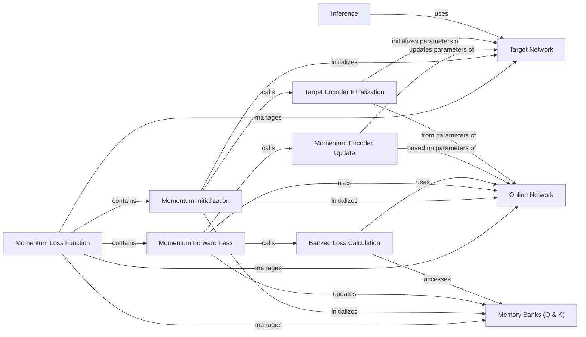

## Details

This section provides a detailed overview of the `Momentum Loss Function` subsystem, focusing on its structure, operational flow, and the purpose of its central components.

### Momentum Loss Function [[Expand]](./Momentum_Loss_Function.md)
This is the overarching module, implemented by the `Momentum` class, which provides a specialized survival analysis framework. It leverages momentum-based learning to decouple batch size from training size by concurrently training an "online" network and a "target" network. The "target" network's parameters are updated using an Exponential Moving Average (EMA) of the "online" network's parameters. The module maintains memory banks of past log hazards from both networks, which are then combined with current batch estimates to compute a specialized loss. This approach aims to improve training stability and performance in survival models.

**Related Classes/Methods**:

- <a href="https://github.com/Novartis/torchsurv/src/torchsurv/loss/momentum.py#L9-L212" target="_blank" rel="noopener noreferrer">`torchsurv.loss.momentum.Momentum` (9:212)</a>

### Momentum Initialization
This component is responsible for the initial setup of the `Momentum` module. It initializes the "online" and "target" networks, synchronizes the initial weights of the target network with the online network, and sets up the double-ended queue memory banks for storing historical log hazards.

**Related Classes/Methods**:

- <a href="https://github.com/Novartis/torchsurv/src/torchsurv/loss/momentum.py#L59-L120" target="_blank" rel="noopener noreferrer">`torchsurv.loss.momentum.Momentum:__init__` (59:120)</a>

### Momentum Forward Pass
This method orchestrates the primary training flow for a given batch of data. It processes the input through the "online" network, updates the memory queues with current and historical log hazards, calculates the specialized loss by combining current and banked estimates, and performs the momentum update for the "target" network's parameters.

**Related Classes/Methods**:

- <a href="https://github.com/Novartis/torchsurv/src/torchsurv/loss/momentum.py#L122-L162" target="_blank" rel="noopener noreferrer">`torchsurv.loss.momentum.Momentum:forward` (122:162)</a>

### Banked Loss Calculation
This internal method computes the survival loss by pooling and combining stored log hazard estimates from the memory banks (both online and target) with the current batch's log hazard estimates. This mechanism allows the loss to be computed over a larger, more diverse set of samples than just the current batch.

**Related Classes/Methods**:

- <a href="https://github.com/Novartis/torchsurv/src/torchsurv/loss/momentum.py#L188-L200" target="_blank" rel="noopener noreferrer">`torchsurv.loss.momentum.Momentum:_bank_loss` (188:200)</a>

### Momentum Encoder Update
This method implements the Exponential Moving Average (EMA) update rule. It updates the parameters of the "target" network by taking a weighted average of its current parameters and the parameters of the "online" network, ensuring a smooth and stable evolution of the target network.

**Related Classes/Methods**:

- <a href="https://github.com/Novartis/torchsurv/src/torchsurv/loss/momentum.py#L203-L206" target="_blank" rel="noopener noreferrer">`torchsurv.loss.momentum.Momentum:_update_momentum_encoder` (203:206)</a>

### Target Encoder Initialization
This helper method is called during initialization to ensure that the "target" network's parameters are initially identical to those of the "online" network. It also disables gradient tracking for the "target" network, as it is updated via EMA rather than direct backpropagation.

**Related Classes/Methods**:

- <a href="https://github.com/Novartis/torchsurv/src/torchsurv/loss/momentum.py#L209-L212" target="_blank" rel="noopener noreferrer">`torchsurv.loss.momentum.Momentum:_init_encoder_k` (209:212)</a>

### Inference
This method provides the mechanism for performing inference (prediction) using the trained model. It specifically utilizes the "target" network, which is considered more stable and robust due to its EMA-based updates, for making predictions on new data.

**Related Classes/Methods**:

- <a href="https://github.com/Novartis/torchsurv/src/torchsurv/loss/momentum.py#L165-L186" target="_blank" rel="noopener noreferrer">`torchsurv.loss.momentum.Momentum:infer` (165:186)</a>

### Online Network
This is the neural network component that processes the current batch of input data. Its outputs (log hazards) are used for immediate gradient calculations and are also pushed into the online memory bank. It is the network that undergoes direct gradient updates during training.

**Related Classes/Methods**: _None_

### Target Network
This is a copy of the "online" network whose parameters are updated via Exponential Moving Average (EMA) of the "online" network's parameters. It serves as a more stable and robust version of the model, used for consistent learning, contributing to the banked loss, and for final inference.

**Related Classes/Methods**: _None_

### Memory Banks (Q & K)
These are double-ended queues (dequeues) that store historical log hazard estimates. Memory Bank (Q) stores estimates from the "online" network, and Memory Bank (K) stores estimates from the "target" network. They are crucial for enabling the loss function to consider a larger context of past samples, effectively decoupling batch size from training size.

**Related Classes/Methods**: _None_

### [FAQ](https://github.com/CodeBoarding/GeneratedOnBoardings/tree/main?tab=readme-ov-file#faq)