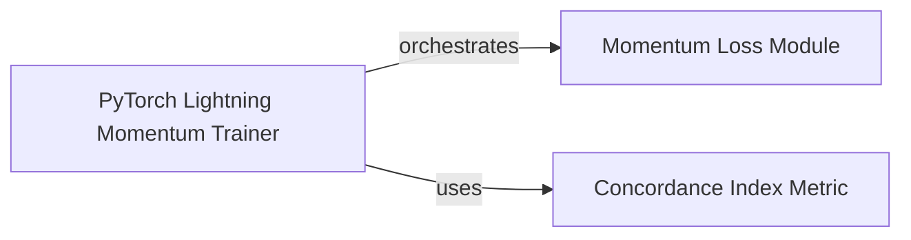

## Details

This section provides a detailed overview of the identified core components, their responsibilities, and their interactions within the `torchsurv` project, specifically focusing on the momentum-based survival analysis training.

### Momentum Loss Module [[Expand]](./Momentum_Loss_Module.md)
This component, encapsulated within the `Momentum` class, implements a specialized loss mechanism designed to decouple batch size during model training in survival analysis. It achieves this by employing two neural networks: an "online" network (`self.online`) and a "target" network (`self.target`). The target network's parameters are updated using an Exponential Moving Average (EMA) of the online network's parameters. The module also maintains a memory bank (`self.memory_k`) of previously computed log hazards from the target network. It orchestrates the initialization of these networks, computes a combined loss from the current batch's online estimates and the memory bank, and updates the target network via EMA. It acts as a flexible wrapper, accepting other survival loss functions (like Cox or Weibull) as callable arguments to integrate them into its momentum-based training loop.

**Related Classes/Methods**:

- <a href="https://github.com/Novartis/torchsurv/src/torchsurv/loss/momentum.py#L9-L212" target="_blank" rel="noopener noreferrer">`torchsurv.src.torchsurv.loss.momentum.Momentum` (9:212)</a>

### PyTorch Lightning Momentum Trainer
This component, identified as `LitMomentum`, is a PyTorch Lightning module that orchestrates the end-to-end training, validation, and testing processes for survival models utilizing the `Momentum Loss Module`. It manages the training loop, handles optimization, and integrates performance evaluation. It is responsible for instantiating and interacting with the `Momentum` module to compute losses and also uses the `ConcordanceIndex` to evaluate the model's performance during training and evaluation phases.

**Related Classes/Methods**:

- <a href="https://github.com/Novartis/torchsurv/docs/notebooks/helpers_momentum.py#L75-L126" target="_blank" rel="noopener noreferrer">`torchsurv.docs.notebooks.helpers_momentum.LitMomentum` (75:126)</a>

### Concordance Index Metric
This component provides the implementation for calculating the Concordance Index (C-index), a standard and widely used metric for evaluating the discriminative ability of survival models. It quantifies the agreement between the predicted risk scores and the observed survival times, indicating how well the model ranks individuals by their risk of an event.

**Related Classes/Methods**:

- <a href="https://github.com/Novartis/torchsurv/src/torchsurv/metrics/cindex.py#L12-L910" target="_blank" rel="noopener noreferrer">`torchsurv.metrics.cindex.ConcordanceIndex` (12:910)</a>

### [FAQ](https://github.com/CodeBoarding/GeneratedOnBoardings/tree/main?tab=readme-ov-file#faq)