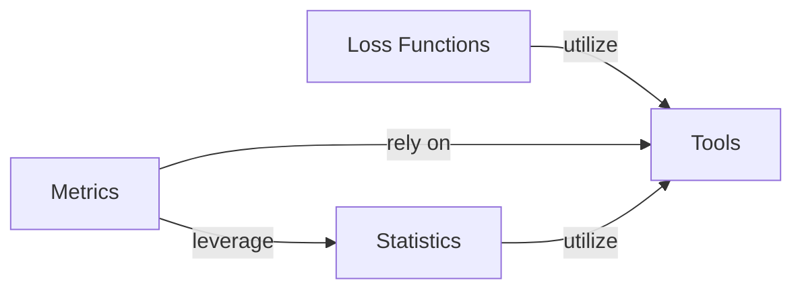

## Details

These four components are fundamental to the `torchsurv` library for the following reasons:

1.  **Loss Functions:** These are the core of any machine learning model, including survival models. They define the objective function that the model optimizes during training, directly influencing how the model learns from data and makes predictions. Without well-defined loss functions, model training is impossible.

2.  **Metrics:** Essential for evaluating the performance and accuracy of survival models. While loss functions guide training, metrics provide an interpretable measure of how well the model generalizes to unseen data and performs against specific survival analysis criteria (e.g., concordance index, Brier score). They are crucial for model selection and comparison.

3.  **Statistics:** This component provides the foundational statistical methodologies specific to survival analysis, such as Kaplan-Meier estimation and IPCW. These methods are often used for descriptive analysis, non-parametric estimation, or as building blocks for more complex models. The inclusion of presentation functionalities (like `plot_km` and `print_survival_table` within `KaplanMeierEstimator`) makes the statistical outputs directly usable and interpretable, which is vital for researchers and practitioners.

4.  **Tools:** This component, though seemingly auxiliary, is critical for the overall robustness, reliability, and maintainability of the `torchsurv` library. By centralizing common utility functions like input validation, it ensures data integrity across all other components, reduces redundant code, and makes the system more resilient to incorrect inputs. This promotes a more stable and user-friendly library.

### Loss Functions [[Expand]](./Loss_Functions.md)
This component provides various loss functions essential for training survival models. These functions quantify the discrepancy between predicted and actual survival outcomes, guiding the model's learning process.

**Related Classes/Methods**:

- <a href="https://github.com/Novartis/torchsurv/src/torchsurv/loss/cox.py#L1-L1" target="_blank" rel="noopener noreferrer">`torchsurv.loss.cox` (1:1)</a>
- <a href="https://github.com/Novartis/torchsurv/src/torchsurv/loss/momentum.py#L1-L1" target="_blank" rel="noopener noreferrer">`torchsurv.loss.momentum` (1:1)</a>
- <a href="https://github.com/Novartis/torchsurv/src/torchsurv/loss/weibull.py#L1-L1" target="_blank" rel="noopener noreferrer">`torchsurv.loss.weibull` (1:1)</a>

### Metrics [[Expand]](./Metrics.md)
This component offers a suite of evaluation metrics specifically tailored for survival analysis. These metrics are used to assess the performance and accuracy of survival models.

**Related Classes/Methods**:

- <a href="https://github.com/Novartis/torchsurv/src/torchsurv/metrics/auc.py#L1-L1" target="_blank" rel="noopener noreferrer">`torchsurv.metrics.auc` (1:1)</a>
- <a href="https://github.com/Novartis/torchsurv/src/torchsurv/metrics/brier_score.py#L1-L1" target="_blank" rel="noopener noreferrer">`torchsurv.metrics.brier_score` (1:1)</a>
- <a href="https://github.com/Novartis/torchsurv/src/torchsurv/metrics/cindex.py#L1-L1" target="_blank" rel="noopener noreferrer">`torchsurv.metrics.cindex` (1:1)</a>

### Statistics [[Expand]](./Statistics.md)
This component provides fundamental statistical utilities relevant to survival analysis, such as methods for Kaplan-Meier estimation and Inverse Probability of Censoring Weighting (IPCW). Crucially, it also encompasses the functionality for presenting the results of Kaplan-Meier estimation in user-friendly formats, including graphical visualizations (`plot_km`) and tabular outputs (`print_survival_table`).

**Related Classes/Methods**:

- <a href="https://github.com/Novartis/torchsurv/src/torchsurv/stats/ipcw.py#L1-L1" target="_blank" rel="noopener noreferrer">`torchsurv.stats.ipcw` (1:1)</a>
- <a href="https://github.com/Novartis/torchsurv/src/torchsurv/stats/kaplan_meier.py#L9-L252" target="_blank" rel="noopener noreferrer">`torchsurv.stats.kaplan_meier.KaplanMeierEstimator` (9:252)</a>
- <a href="https://github.com/Novartis/torchsurv/src/torchsurv/stats/kaplan_meier.py#L94-L124" target="_blank" rel="noopener noreferrer">`torchsurv.stats.kaplan_meier.KaplanMeierEstimator:plot_km` (94:124)</a>
- <a href="https://github.com/Novartis/torchsurv/src/torchsurv/stats/kaplan_meier.py#L179-L195" target="_blank" rel="noopener noreferrer">`torchsurv.stats.kaplan_meier.KaplanMeierEstimator:print_survival_table` (179:195)</a>

### Tools
This component contains common utility functions that support other parts of the `torchsurv` library. Specifically, it includes input validation routines to ensure that data passed to other components meets the expected format and constraints, thereby enhancing the robustness and reliability of the system.

**Related Classes/Methods**:

- <a href="https://github.com/Novartis/torchsurv/src/torchsurv/tools/validate_inputs.py#L1-L1" target="_blank" rel="noopener noreferrer">`torchsurv.tools.validate_inputs` (1:1)</a>

### [FAQ](https://github.com/CodeBoarding/GeneratedOnBoardings/tree/main?tab=readme-ov-file#faq)