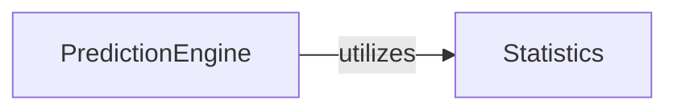

## Details

Analysis of PredictionEngine component and its relationship with the Statistics component in the context of Kaplan-Meier estimation.

### PredictionEngine [[Expand]](./PredictionEngine.md)
This component, implemented as the `predict` method within `KaplanMeierEstimator`, enables the prediction of Kaplan-Meier estimates at new, arbitrary time points. It interpolates or extrapolates from the calculated survival function to provide probabilities for times not directly observed in the input data.

**Related Classes/Methods**:

- `KaplanMeierEstimator:predict` (0:0)

### Statistics [[Expand]](./Statistics.md)
Handles statistical estimations, including the Kaplan-Meier estimator.

**Related Classes/Methods**:

- `KaplanMeierEstimator` (0:0)

### [FAQ](https://github.com/CodeBoarding/GeneratedOnBoardings/tree/main?tab=readme-ov-file#faq)