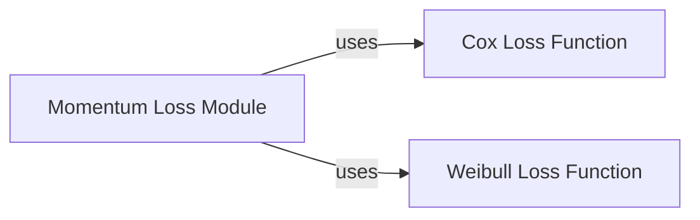

## Details

The `Survival Loss Functions` module in `torchsurv` provides a dedicated collection of loss functions essential for training survival models. Its primary purpose is to enable models to learn effectively from survival data, which often includes censored observations. The module is structured around three core components, each addressing a specific aspect of survival analysis loss calculation: the Cox Proportional Hazards loss, the Weibull Accelerated Failure Time (AFT) loss, and a Momentum-based loss mechanism for advanced training strategies. The module's design emphasizes modularity, with each loss function residing in its own dedicated file, promoting clear separation of concerns and ease of maintenance. While `getClassHierarchy` indicates no explicit class inheritance within the `torchsurv.loss` package, the components interact by allowing the `Momentum Loss Module` to wrap and utilize the other loss functions, demonstrating a composition-based relationship.

### Cox Loss Function [[Expand]](./Cox_Loss_Function.md)
This component is responsible for calculating the negative partial log-likelihood, a standard objective for Cox proportional hazards models. It offers robust handling of tied event times through Cox, Efron, and Breslow approximation methods, making it versatile for various datasets. It includes internal helper functions for these calculations and input validation to ensure data integrity.

**Related Classes/Methods**:

- `neg_partial_log_likelihood` (0:0)
- `_partial_likelihood_cox` (0:0)
- `_partial_likelihood_efron` (0:0)
- `_partial_likelihood_breslow` (0:0)
- `_check_inputs` (0:0)

### Weibull Loss Function
This component computes the negative log-likelihood for models that assume a Weibull distribution within an Accelerated Failure Time (AFT) framework. It provides helper functions for calculating survival probability, log hazard, and cumulative hazard, along with internal validation checks to ensure correct input shapes for the logarithmic operations.

**Related Classes/Methods**:

- `neg_log_likelihood` (0:0)
- `survival_function` (0:0)
- `log_hazard` (0:0)
- `cumulative_hazard` (0:0)
- `_check_log_shape` (0:0)
- `_check_inputs` (0:0)

### Momentum Loss Module [[Expand]](./Momentum_Loss_Module.md)
This component implements a specialized loss mechanism, encapsulated within the `Momentum` class, designed to decouple batch size during model training using a momentum-based encoder and a memory bank. It orchestrates the initialization of "online" and "target" networks, computes a combined loss from current and memory bank data, and updates the target network using an Exponential Moving Average (EMA). It acts as a wrapper, accepting other survival loss functions (like Cox or Weibull) as callable arguments to integrate them into its momentum-based training loop.

**Related Classes/Methods**:

- <a href="https://github.com/Novartis/torchsurv/src/torchsurv/loss/momentum.py#L9-L212" target="_blank" rel="noopener noreferrer">`Momentum` (9:212)</a>
- <a href="https://github.com/Novartis/torchsurv/src/torchsurv/__init__.py#L0-L0" target="_blank" rel="noopener noreferrer">`__init__` (0:0)</a>
- `forward` (0:0)
- `_init_encoder_k` (0:0)
- `_bank_loss` (0:0)
- `_update_momentum_encoder` (0:0)
- `infer` (0:0)

### [FAQ](https://github.com/CodeBoarding/GeneratedOnBoardings/tree/main?tab=readme-ov-file#faq)