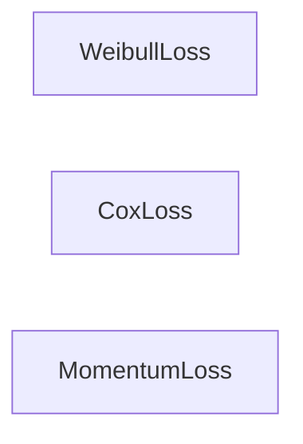

## Details

This module serves as a central collection point for various loss functions specifically designed for survival analysis. It provides a unified interface for accessing specialized loss functions such as Cox, Momentum, and Weibull, which are essential for training survival models. These functions quantify prediction errors against censored and uncensored survival data, enabling models to learn and improve their predictions of time-to-event outcomes.

### WeibullLoss
This component is responsible for computing the negative log-likelihood for models that assume a Weibull distribution for survival times. It provides methods for calculating survival probability, log hazard, and cumulative hazard, along with internal validation checks to ensure correct input shapes. It is fundamental for models that explicitly parameterize the survival distribution.

**Related Classes/Methods**:

- `WeibullLoss:_check_inputs` (0:0)
- `WeibullLoss:_check_log_shape` (0:0)
- `WeibullLoss:neg_log_likelihood` (0:0)
- `WeibullLoss:log_hazard` (0:0)
- `WeibullLoss:cumulative_hazard` (0:0)
- `WeibullLoss:survival_function` (0:0)

### CoxLoss
This component handles the calculation of the negative partial log-likelihood for Cox proportional hazards models. It supports different approximation methods for handling ties in survival data, namely Cox, Efron, and Breslow, making it versatile for various datasets. It is fundamental as the Cox model is a cornerstone of survival analysis.

**Related Classes/Methods**:

- `CoxLoss:_partial_likelihood_cox` (0:0)
- `CoxLoss:_partial_likelihood_efron` (0:0)
- `CoxLoss:_partial_likelihood_breslow` (0:0)
- `CoxLoss:_check_inputs` (0:0)

### MomentumLoss
This component implements a specialized loss mechanism, likely involving a momentum-based encoder and a memory bank, often used in self-supervised learning contexts for survival analysis. It manages the initialization of the encoder and the forward pass, which includes bank loss calculations and updates to the momentum encoder. It is fundamental for advanced, representation-learning-based survival models.

**Related Classes/Methods**:

- `MomentumLoss:__init__` (0:0)
- `MomentumLoss:_init_encoder_k` (0:0)
- `MomentumLoss:forward` (0:0)
- `MomentumLoss:_bank_loss` (0:0)
- `MomentumLoss:_update_momentum_encoder` (0:0)

### [FAQ](https://github.com/CodeBoarding/GeneratedOnBoardings/tree/main?tab=readme-ov-file#faq)