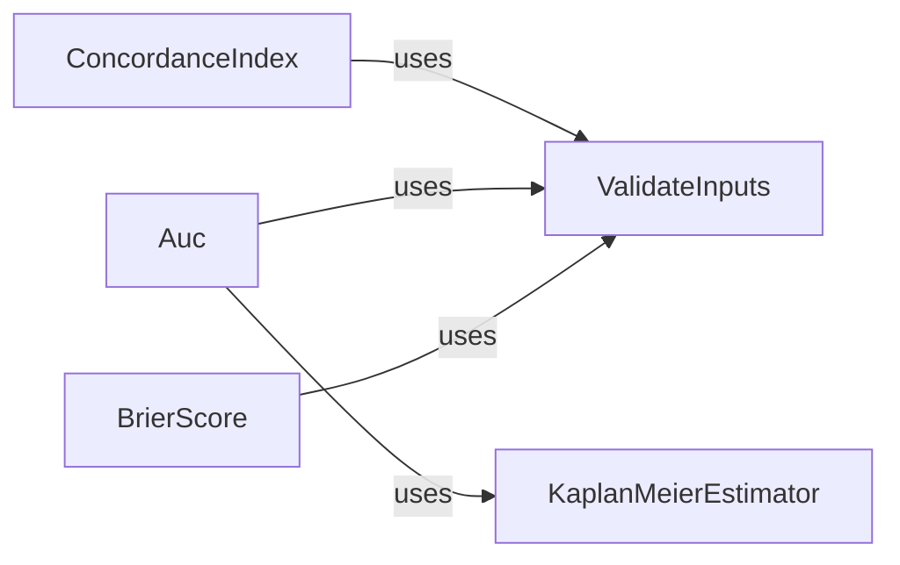

## Details

The `Survival Metrics` module provides a comprehensive set of tools for evaluating survival models, focusing on key metrics like Concordance Index (C-index), Area Under the Curve (AUC), and Brier Score. The analysis reveals a modular structure where each metric is encapsulated within its own component, leveraging shared utility components for input validation and survival function estimation.

### ConcordanceIndex [[Expand]](./ConcordanceIndex.md)
This component calculates the Concordance Index (C-index), a widely used metric to assess the discriminative ability of survival models. It handles the comparison of predicted risks with observed survival outcomes and provides methods for confidence interval estimation, p-value calculation, and comparison between two C-index values using various statistical approaches (Noether, Bootstrap, Conservative).

**Related Classes/Methods**:

- `ConcordanceIndex` (0:0)

### Auc [[Expand]](./Auc.md)
This component calculates the time-dependent Area Under the Curve (AUC) for survival data. It evaluates how well a model discriminates between events and non-events at specific time points. It supports different methods for confidence interval, p-value, and comparison (Blanche, Bootstrap).

**Related Classes/Methods**:

- <a href="https://github.com/Novartis/torchsurv/src/torchsurv/metrics/auc.py#L12-L1283" target="_blank" rel="noopener noreferrer">`Auc` (12:1283)</a>

### BrierScore [[Expand]](./BrierScore.md)
This component computes the Brier Score, a measure of the accuracy of survival probability predictions. It quantifies the mean squared difference between predicted probabilities and observed survival status. It also offers methods for confidence interval, p-value, and comparison using parametric and bootstrap approaches.

**Related Classes/Methods**:

- <a href="https://github.com/Novartis/torchsurv/src/torchsurv/metrics/brier_score.py#L10-L903" target="_blank" rel="noopener noreferrer">`BrierScore` (10:903)</a>

### ValidateInputs [[Expand]](./ValidateInputs.md)
This utility component provides a set of functions to validate various inputs used across the survival analysis metrics. Its purpose is to ensure that the input data (e.g., survival times, event indicators, model estimates, evaluation times) conforms to expected formats and constraints, preventing errors and ensuring the reliability of downstream calculations.

**Related Classes/Methods**:

- <a href="https://github.com/Novartis/torchsurv/src/torchsurv/tools/validate_inputs.py#L0-L0" target="_blank" rel="noopener noreferrer">`ValidateInputs` (0:0)</a>

### KaplanMeierEstimator [[Expand]](./KaplanMeierEstimator.md)
This component implements the Kaplan-Meier estimator, a non-parametric method used to estimate the survival function from survival data, especially in the presence of censored observations. It provides the estimated survival probabilities over time.

**Related Classes/Methods**:

- `KaplanMeierEstimator` (0:0)

### [FAQ](https://github.com/CodeBoarding/GeneratedOnBoardings/tree/main?tab=readme-ov-file#faq)