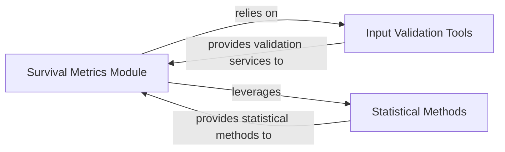

## Details

This analysis focuses on the Survival Metrics Module (torchsurv.metrics), its internal structure, and its interactions with other key components within the torchsurv project.

### Survival Metrics Module [[Expand]](./Survival_Metrics_Module.md)
This module (torchsurv.metrics) serves as the central hub for various survival model evaluation metrics. It provides a unified interface for assessing model performance by encapsulating implementations of standard metrics such as Area Under the Curve (AUC), Brier Score, and Concordance Index (C-index). Users interact with this module as the primary entry point to access and apply these evaluation tools. The getClassHierarchy output indicates that this module primarily consists of functions rather than a complex class hierarchy.

**Related Classes/Methods**: _None_

### Input Validation Tools
This component (torchsurv.tools.validate_inputs) is dedicated to robust input validation. Its purpose is to ensure data integrity and correct computation by verifying the format, type, and validity of inputs provided to the survival metrics functions.

**Related Classes/Methods**: _None_

### Statistical Methods
This component (torchsurv.stats) provides essential statistical methods required for accurate survival analysis, particularly for handling censored data. Key functionalities include Inverse Probability of Censoring Weighting (IPCW) and potentially Kaplan-Meier estimation, which are crucial for unbiased metric calculations.

**Related Classes/Methods**: _None_

### [FAQ](https://github.com/CodeBoarding/GeneratedOnBoardings/tree/main?tab=readme-ov-file#faq)