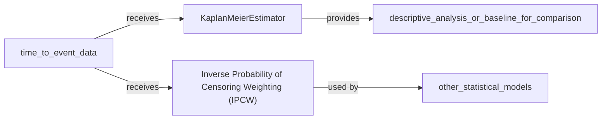

## Details

The `torchsurv.stats` package, specifically the `Survival Statistics` component, provides essential tools for survival analysis. The `KaplanMeierEstimator` provides a direct, non-parametric way to estimate and visualize the survival curve. `IPCW` offers a method to handle censoring bias in more complex statistical models. Their relationship is primarily complementary within the broader field of survival analysis, rather than direct interaction with each other. Both receive time-to-event data as input. The Kaplan-Meier Estimator provides survival curve estimates for descriptive analysis, while IPCW provides weights used by other statistical models to adjust for censoring.

### KaplanMeierEstimator [[Expand]](./KaplanMeierEstimator.md)
This component implements the Kaplan-Meier estimator, a non-parametric statistic used to estimate the survival function from lifetime data. It is crucial for visualizing and analyzing time-to-event data, especially in the presence of censored observations. It provides estimates of survival probabilities over time.

**Related Classes/Methods**:

- <a href="https://github.com/Novartis/torchsurv/src/torchsurv/stats/kaplan_meier.py#L9-L252" target="_blank" rel="noopener noreferrer">`torchsurv.stats.kaplan_meier.KaplanMeierEstimator` (9:252)</a>

### Inverse Probability of Censoring Weighting (IPCW) [[Expand]](./Inverse_Probability_of_Censoring_Weighting_IPCW_.md)
This component provides functionality for Inverse Probability of Censoring Weighting (IPCW). IPCW is a statistical technique used to adjust for censoring in survival analysis, allowing for unbiased estimation of various quantities (e.g., means, regression coefficients) when censoring is present and informative. It effectively re-weights uncensored observations to account for those that were censored.

**Related Classes/Methods**:

- <a href="https://github.com/Novartis/torchsurv/src/torchsurv/stats/ipcw.py#L11-L76" target="_blank" rel="noopener noreferrer">`torchsurv.stats.ipcw.get_ipcw` (11:76)</a>

### [FAQ](https://github.com/CodeBoarding/GeneratedOnBoardings/tree/main?tab=readme-ov-file#faq)