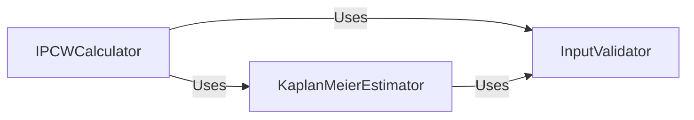

## Details

Abstract Components Overview

### KaplanMeierEstimator [[Expand]](./KaplanMeierEstimator.md)
This component is responsible for computing the non-parametric Kaplan-Meier survival estimates. It can estimate both the survival distribution (probability of surviving beyond a certain time) and the censoring distribution (probability of being uncensored beyond a certain time). It provides methods for calculation, prediction on new time points, and visualization.

**Related Classes/Methods**:

- <a href="https://github.com/Novartis/torchsurv/src/torchsurv/stats/kaplan_meier.py#L9-L252" target="_blank" rel="noopener noreferrer">`torchsurv.stats.kaplan_meier.KaplanMeierEstimator` (9:252)</a>

### IPCWCalculator [[Expand]](./IPCWCalculator.md)
This component calculates Inverse Probability of Censoring Weights (IPCW). IPCW is a technique used to adjust for censoring in survival data, allowing for unbiased estimation of various quantities (e.g., average treatment effects) by weighting observations by the inverse of their probability of being uncensored. It relies on the Kaplan-Meier estimator to model the censoring distribution and utilizes input validation.

**Related Classes/Methods**:

- <a href="https://github.com/Novartis/torchsurv/src/torchsurv/stats/ipcw.py#L11-L76" target="_blank" rel="noopener noreferrer">`torchsurv.stats.ipcw.get_ipcw` (11:76)</a>

### InputValidator [[Expand]](./InputValidator.md)
This utility component is responsible for validating the format, types, and integrity of survival data inputs (event indicators and time-to-event/censoring) used across various functions and classes within the `torchsurv` subsystem. It ensures that the data conforms to expected structures before statistical computations are performed, preventing errors and ensuring reliable results.

**Related Classes/Methods**:

- <a href="https://github.com/Novartis/torchsurv/src/torchsurv/tools/validate_inputs.py#L3-L37" target="_blank" rel="noopener noreferrer">`torchsurv.tools.validate_inputs.validate_survival_data` (3:37)</a>
- <a href="https://github.com/Novartis/torchsurv/src/torchsurv/tools/validate_inputs.py#L40-L83" target="_blank" rel="noopener noreferrer">`torchsurv.tools.validate_inputs.validate_evaluation_time` (40:83)</a>
- <a href="https://github.com/Novartis/torchsurv/src/torchsurv/tools/validate_inputs.py#L86-L120" target="_blank" rel="noopener noreferrer">`torchsurv.tools.validate_inputs.validate_estimate` (86:120)</a>

### [FAQ](https://github.com/CodeBoarding/GeneratedOnBoardings/tree/main?tab=readme-ov-file#faq)