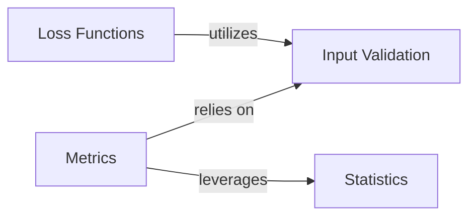

## Details

These four components are fundamental to the `torchsurv` library because they cover the essential aspects of building, training, and evaluating survival models:

### Input Validation [[Expand]](./Input_Validation.md)
This utility component provides a set of functions to validate various inputs used across the survival analysis metrics and loss functions. Its primary purpose is to ensure that all input data (e.g., survival times, event indicators, model estimates, evaluation times) conforms to expected formats, data types, and constraints. This prevents common errors, ensures the reliability of downstream calculations, and enhances the robustness of the entire `torchsurv` library.

**Related Classes/Methods**:

- `Input Validation` (1:1)

### Loss Functions [[Expand]](./Loss_Functions.md)
This component encapsulates various loss functions crucial for training survival models. These functions quantify the discrepancy between predicted and actual survival outcomes, guiding the model's learning process by providing a measure of error to be minimized during optimization. They are essential for enabling the training of robust survival prediction models.

**Related Classes/Methods**:

- `Loss Functions` (1:1)
- `Loss Functions` (1:1)
- `Loss Functions` (1:1)

### Metrics [[Expand]](./Metrics.md)
This component provides a suite of evaluation metrics specifically designed for survival analysis. These metrics are used to assess the performance, accuracy, and discriminative power of survival models, offering quantitative insights into how well a model predicts survival outcomes. They are fundamental for model selection, hyperparameter tuning, and understanding the real-world applicability of survival models.

**Related Classes/Methods**:

- `Metrics` (1:1)
- `Metrics` (1:1)
- `Metrics` (1:1)

### Statistics [[Expand]](./Statistics.md)
This component offers statistical utilities relevant to survival analysis. It includes methods for non-parametric estimation of survival curves (Kaplan-Meier) and techniques for handling censored data, such as Inverse Probability of Censoring Weighting (IPCW). These utilities are often used for data preparation, exploratory data analysis, or as part of more complex model evaluation procedures, providing the statistical backbone for handling survival data.

**Related Classes/Methods**:

- `Statistics` (1:1)
- `Statistics` (1:1)

### [FAQ](https://github.com/CodeBoarding/GeneratedOnBoardings/tree/main?tab=readme-ov-file#faq)