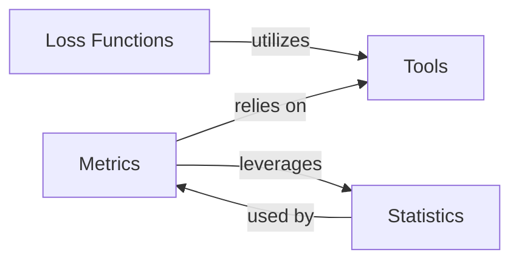

## Details

The `Weibull Loss Module` is a fundamental part of the `Loss Functions` component within the `torchsurv` library. It specifically implements the Weibull Accelerated Failure Time (AFT) loss function, which is crucial for training survival models that directly estimate survival times. These components are fundamental because they cover the core aspects of building and evaluating survival models: defining the learning objective (Loss Functions), assessing performance (Metrics), handling the unique challenges of survival data (Statistics), and ensuring data quality and system robustness (Tools). The `Weibull Loss Module` fits directly into the `Loss Functions` component, providing a specific and important loss function for a common type of survival model.

### Loss Functions [[Expand]](./Loss_Functions.md)
This component provides various loss functions essential for training survival models. These functions quantify the discrepancy between predicted and actual survival outcomes, guiding the model's learning process.

**Related Classes/Methods**:

- <a href="https://github.com/Novartis/torchsurv/src/torchsurv/loss/weibull.py#L1-L1" target="_blank" rel="noopener noreferrer">`torchsurv.loss.weibull.WeibullLoss` (1:1)</a>
- <a href="https://github.com/Novartis/torchsurv/src/torchsurv/loss/cox.py#L1-L1" target="_blank" rel="noopener noreferrer">`torchsurv.loss.cox` (1:1)</a>
- <a href="https://github.com/Novartis/torchsurv/src/torchsurv/loss/momentum.py#L1-L1" target="_blank" rel="noopener noreferrer">`torchsurv.loss.momentum` (1:1)</a>

### Metrics [[Expand]](./Metrics.md)
This component offers a suite of evaluation metrics specifically tailored for survival analysis. These metrics are used to assess the performance and accuracy of survival models, providing quantitative measures of how well a model predicts survival outcomes.

**Related Classes/Methods**:

- <a href="https://github.com/Novartis/torchsurv/src/torchsurv/metrics/cindex.py#L1-L1" target="_blank" rel="noopener noreferrer">`torchsurv.metrics.cindex` (1:1)</a>
- <a href="https://github.com/Novartis/torchsurv/src/torchsurv/metrics/auc.py#L1-L1" target="_blank" rel="noopener noreferrer">`torchsurv.metrics.auc` (1:1)</a>
- <a href="https://github.com/Novartis/torchsurv/src/torchsurv/metrics/brier_score.py#L1-L1" target="_blank" rel="noopener noreferrer">`torchsurv.metrics.brier_score` (1:1)</a>

### Statistics [[Expand]](./Statistics.md)
This component provides fundamental statistical utilities relevant to survival analysis. These include methods for non-parametric estimation of survival curves (Kaplan-Meier) and techniques for handling censored data (Inverse Probability of Censoring Weighting).

**Related Classes/Methods**:

- <a href="https://github.com/Novartis/torchsurv/src/torchsurv/stats/kaplan_meier.py#L1-L1" target="_blank" rel="noopener noreferrer">`torchsurv.stats.kaplan_meier` (1:1)</a>
- <a href="https://github.com/Novartis/torchsurv/src/torchsurv/stats/ipcw.py#L1-L1" target="_blank" rel="noopener noreferrer">`torchsurv.stats.ipcw` (1:1)</a>

### Tools
This component serves as a utility hub, containing helper functions that support various other parts of the `torchsurv` library. Its primary role is to provide input validation routines, ensuring that data passed between components meets the expected format and constraints.

**Related Classes/Methods**:

- <a href="https://github.com/Novartis/torchsurv/src/torchsurv/tools/validate_inputs.py#L1-L1" target="_blank" rel="noopener noreferrer">`torchsurv.tools.validate_inputs` (1:1)</a>

### [FAQ](https://github.com/CodeBoarding/GeneratedOnBoardings/tree/main?tab=readme-ov-file#faq)