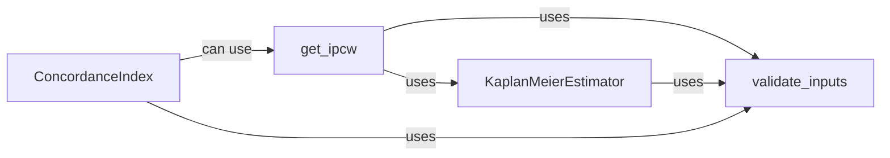

## Details

The `get_ipcw` subsystem is central to handling censored data in survival analysis within `torchsurv`, specifically for calculating Inverse Probability Censoring Weights (IPCW). These weights are crucial for unbiased estimation in the presence of censoring, particularly when computing metrics like Uno's C-index.

### get_ipcw [[Expand]](./get_ipcw.md)
This is the primary public function within the IPCW component. It calculates the inverse probability censoring weights. It acts as the entry point for users to compute IPCW, coordinating the validation of inputs, fitting the censoring model, and calculating the inverse censoring distribution.

**Related Classes/Methods**:

- `get_ipcw` (1:1)

### KaplanMeierEstimator [[Expand]](./KaplanMeierEstimator.md)
This class implements the Kaplan-Meier estimator, a non-parametric statistic used to estimate the survival function from lifetime data. In the context of IPCW, it's specifically used to estimate the censoring distribution. It can also predict survival/censoring probabilities at new time points.

**Related Classes/Methods**:

- `KaplanMeierEstimator` (1:1)

### validate_inputs
This module provides essential utility functions for validating the format and integrity of survival data inputs across various `torchsurv` components. This ensures data consistency and prevents common errors in survival analysis computations.

**Related Classes/Methods**:

- <a href="https://github.com/Novartis/torchsurv/src/torchsurv/tools/validate_inputs.py#L1-L1" target="_blank" rel="noopener noreferrer">`validate_inputs` (1:1)</a>

### ConcordanceIndex [[Expand]](./ConcordanceIndex.md)
This component is a crucial metric class used to evaluate the performance of survival models by calculating the Concordance Index (C-index). It assesses the ranking accuracy of predicted risk scores against observed event times. It supports both the standard Harrell's C-index and the IPCW-weighted Uno's C-index, and provides functionalities for confidence interval and p-value calculations.

**Related Classes/Methods**:

- `ConcordanceIndex` (1:1)

### [FAQ](https://github.com/CodeBoarding/GeneratedOnBoardings/tree/main?tab=readme-ov-file#faq)