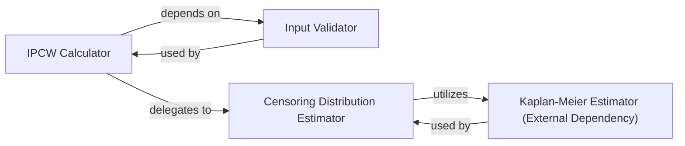

## Details

The `torchsurv.stats.ipcw` component is designed to calculate Inverse Probability of Censoring Weights (IPCW), which are essential for unbiased estimation in survival analysis, particularly for metrics like the Brier Score. Despite the `getClassHierarchy` tool not identifying explicit class hierarchies within this specific package, the component's functionality is primarily driven by a set of well-defined functions and their interactions.

### IPCW Calculator
This is the core orchestrator of the IPCW calculation process. It serves as the primary interface for users, taking survival data (event times, event indicators, and optional features) and coordinating the steps to compute the final IPCW values. It ensures that inputs are validated, the censoring distribution is estimated, and the inverse probabilities are correctly applied.

**Related Classes/Methods**:

- <a href="https://github.com/Novartis/torchsurv/src/torchsurv/stats/ipcw.py#L11-L76" target="_blank" rel="noopener noreferrer">`torchsurv.stats.ipcw.get_ipcw` (11:76)</a>

### Input Validator
This utility component is responsible for rigorously checking the format and validity of the input survival data. It ensures that event times are non-negative and that event indicators are binary (0 or 1). By performing these checks upfront, it prevents erroneous computations and provides clear feedback to the user about invalid inputs.

**Related Classes/Methods**:

- <a href="https://github.com/Novartis/torchsurv/src/torchsurv/stats/ipcw.py#L0-L0" target="_blank" rel="noopener noreferrer">`torchsurv.stats.ipcw.validate_survival_data` (0:0)</a>

### Censoring Distribution Estimator
This specialized helper component calculates the inverse of the censoring distribution. This is a crucial intermediate step in IPCW computation, as it estimates the probability of an individual remaining uncensored up to a given time point. It leverages a Kaplan-Meier estimator to model the censoring times.

**Related Classes/Methods**:

- <a href="https://github.com/Novartis/torchsurv/src/torchsurv/stats/ipcw.py#L79-L103" target="_blank" rel="noopener noreferrer">`torchsurv.stats.ipcw._inverse_censoring_dist` (79:103)</a>

### Kaplan-Meier Estimator (External Dependency)
While not directly defined within `torchsurv.stats.ipcw.py`, this component (likely from `torchsurv.models.kaplan_meier`) implements the Kaplan-Meier method. It's a non-parametric statistical method used to estimate the survival function from lifetime data. In the context of IPCW, it is specifically utilized by the `Censoring Distribution Estimator` to model and predict the *censoring* probabilities.

**Related Classes/Methods**:

- `torchsurv.models.kaplan_meier.KaplanMeierEstimator` (0:0)

### [FAQ](https://github.com/CodeBoarding/GeneratedOnBoardings/tree/main?tab=readme-ov-file#faq)